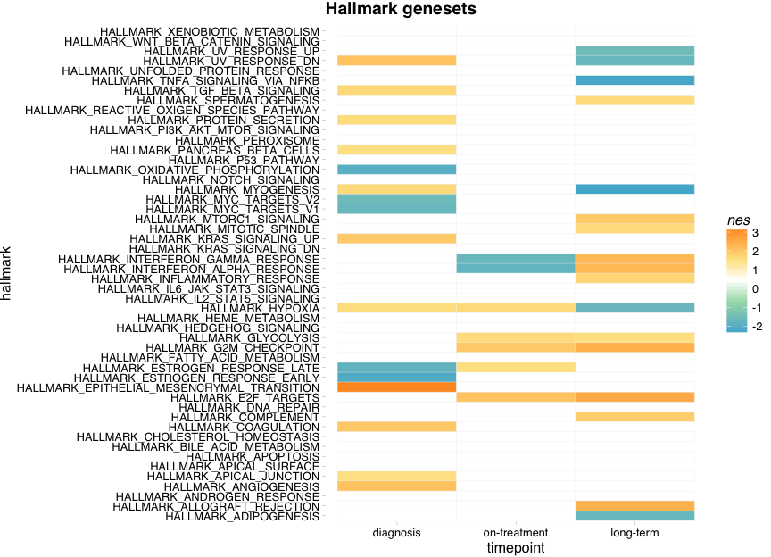

Hallmarks GSEA
================
Dominic Pearce

``` r
library(tidyverse)
library(GSEABase)
library(phenoTest)
```

``` r
dormset <- read_rds("../output/dormset.rds")
```

#### Here we're going to compare enrichment of the [Hallmark genesets](https://www.ncbi.nlm.nih.gov/pubmed/26771021) between dormant and desensitised patients.

#### First we'll need to assemble the Hallmark genesets themselves, as a sensible easy to use list of ids that are present in `dormset`.

``` r
hallmarks <- getGmt("../data/h.all.v6.1.symbols.gmt")
genesets <- geneIds(hallmarks)

intersets <- lapply(genesets, function(set){
                        intersect(set, row.names(dormset))
})
```

#### We'll begin by arranging our data as two sets - dormants & desensitiseds (*//NOTE* This is an unpaired comparison). Then we calculate the significant **NES** scores, and plot.

``` r
dorm_xpr <- exprs(dormset[, which(dormset$is_dormant)]) %>% rowMeans()
dssd_xpr <- exprs(dormset[, which(!dormset$is_dormant)]) %>% rowMeans()

fc_vec <- sort(dssd_xpr - dorm_xpr)

hallmarks_out <- gsea(x = fc_vec, gsets = intersets, logScale = FALSE)
```

    ## The provided gene sets have more than 10 distinct lengths, therefore gam approximation will be used.

``` r
arrangeGSEA <- function(gsea_out, comparison = NA, dormancy = NA){
    dfr <- data.frame(summary(gsea_out)[, c("nes", "fdr")])
    dfr[dfr$fdr >= 0.05, "nes"] <- NA
    dfr$hallmark <- row.names(dfr)
    dfr$comparison <- comparison
    dfr$dormancy <- dormancy
    dfr
}
hm_dfr <- arrangeGSEA(hallmarks_out, comparison = "Dormant-Desensitised")
```

``` r
ggplot(hm_dfr, aes(x = comparison, y = hallmark, fill = nes)) + 
    geom_tile(colour = "white") +
    scale_fill_gradientn(values=c(1, .7, .5, .3, 0), colours=rev(c("#4eb3d3", "#a8ddb5", "white", "#fee391", "#fe9929")), na.value = "white")
```


#### Now we'll take advantage of our paired data and look at fold change overtime, separtely for dormant and desensitised patients

#### First we'll write a fold-change function for expressionsets

``` r
getFC <- function(eset, id1, id2, id_col, patient_col){
    intset <- eset[, which(pData(eset)[[id_col]] == id1 | pData(eset)[[id_col]] == id2)]
    singles <- table(intset[[patient_col]]) %>% .[.==1] %>% names()
    fcset <- intset[, -which(intset[[patient_col]] %in% singles)]
    a_set <- fcset[, fcset[[id_col]] == id1]
    b_set <- fcset[, fcset[[id_col]] == id2]
    exprs(b_set) - exprs(a_set)
}
```

#### Dormant GSEA

``` r
eset_base <- dormset[, which(dormset$is_dormant)]
eset_dorm <- eset_base[,  -which(eset_base$timepoint_split != "A")]

dorm_dlt <- getFC(eset_dorm, "diagnosis", "long-term", "timepoint", "patient") %>% 
            rowMeans() %>% 
            sort() %>% 
            gsea(gsets = intersets, logScale = FALSE, center = TRUE) %>% 
            arrangeGSEA(comparison = "D-LT", dormancy = "Dormant")
```

    ## The provided gene sets have more than 10 distinct lengths, therefore gam approximation will be used.

``` r
dorm_dot <- getFC(eset_dorm, "diagnosis", "on-treatment", "timepoint", "patient") %>% 
            rowMeans() %>% 
            sort() %>% 
            gsea(gsets = intersets, logScale = FALSE, center = TRUE) %>% 
            arrangeGSEA(comparison = "D-OT", dormancy = "Dormant")
```

    ## The provided gene sets have more than 10 distinct lengths, therefore gam approximation will be used.

``` r
dorm_otlt <- getFC(eset_dorm, "on-treatment", "long-term", "timepoint", "patient") %>% 
            rowMeans() %>% 
            sort() %>% 
            gsea(gsets = intersets, logScale = FALSE, center = TRUE) %>% 
            arrangeGSEA(comparison = "OT-LT", dormancy = "Dormant")
```

    ## The provided gene sets have more than 10 distinct lengths, therefore gam approximation will be used.

#### Desensitised GSEA

``` r
eset_base <- dormset[, which(!dormset$is_dormant)]
eset_dssn <- eset_base[,  -which(eset_base$timepoint_split != "A")]

dssn_dlt <- getFC(eset_dssn, "diagnosis", "long-term", "timepoint", "patient") %>% 
            rowMeans() %>% 
            sort() %>% 
            gsea(gsets = intersets, logScale = FALSE, center = TRUE) %>% 
            arrangeGSEA(comparison = "D-LT", dormancy = "Desensitised")
```

    ## The provided gene sets have more than 10 distinct lengths, therefore gam approximation will be used.

``` r
dssn_dot <- getFC(eset_dssn, "diagnosis", "on-treatment", "timepoint", "patient") %>% 
            rowMeans() %>% 
            sort() %>% 
            gsea(gsets = intersets, logScale = FALSE, center = TRUE) %>% 
            arrangeGSEA(comparison = "D-OT", dormancy = "Desensitised")
```

    ## The provided gene sets have more than 10 distinct lengths, therefore gam approximation will be used.

``` r
dssn_otlt <- getFC(eset_dssn, "on-treatment", "long-term", "timepoint", "patient") %>% 
            rowMeans() %>% 
            sort() %>% 
            gsea(gsets = intersets, logScale = FALSE, center = TRUE) %>% 
            arrangeGSEA(comparison = "OT-LT", dormancy = "Desensitised")
```

    ## The provided gene sets have more than 10 distinct lengths, therefore gam approximation will be used.

#### Combine and plot

``` r
gsea_dfr <- do.call(rbind, list(dorm_dlt, dorm_dot, dorm_otlt, dssn_dlt, dssn_dot, dssn_otlt))
gsea_dfr$dormancy <- factor(gsea_dfr$dormancy, levels = c("Dormant", "Desensitised")) 
gsea_dfr$comparison <- factor(gsea_dfr$comparison, levels = c("D-OT", "D-LT", "OT-LT")) 

ggplot(gsea_dfr, aes(x = dormancy, y = hallmark, fill = nes)) +
    geom_tile(colour = "#f0f0f0") +
    facet_wrap(~comparison, nrow = 1) +
    scale_fill_gradientn(values=c(1, .7, .5, .3, 0), colours=rev(c("#4eb3d3", "#a8ddb5", "white", "#fee391", "#fe9929")), na.value = "white")
```



``` r
ggplot(gsea_dfr, aes(x = comparison, y = hallmark, fill = nes)) +
    geom_tile(colour = "#f0f0f0") +
    facet_wrap(~dormancy, nrow = 1) +
    scale_fill_gradientn(values=c(1, .7, .5, .3, 0), colours=rev(c("#4eb3d3", "#a8ddb5", "white", "#fee391", "#fe9929")), na.value = "white")
```


#### Enrichment differences between Dormant and Desensitised in &gt;= 2 comparisons

-   xenobiotic metabolism...
-   uv response up
-   wnt signalling
-   ros
-   interferon alpha
