Hallmarks heatmaps
================
Dominic Pearce

<!--
####Setup
-->
``` r
library(tidyverse)
library(Biobase)
library(GSEABase)
library(cowplot); theme_set(theme_grey())
source("../../lib/arrangeGSEAGenesets.R")
source("../../../../functions/library/heatmapArrange.R")
```

``` r
dormset <- read_rds("../output/dormset.rds")
hallmarks <- getGmt("../data/h.all.v6.1.symbols.gmt") %>% arrangeGenesets(dormset)

#Significant hallmarks for various comparisons
hm_all <- readLines("../output/hm-gsea-unpaired-all.txt")
hm_diagnosis <- readLines("../output/hm-gsea-unpaired-diagnosis.txt")
hm_on <- readLines("../output/hm-gsea-unpaired-on-treatment.txt")
hm_long <- readLines("../output/hm-gsea-unpaired-long-term.txt")
```

#### Here we're looking to take a geneset that we've determined as informative in *hallmarks-gsea.Rmd* and display the per-sample expression as a heatmap.

``` r
heatmapPlot <- function(eset, geneset, title){
        #arrange
        esub <- eset[geneset,]
        dfr <- heatmapArrange(exprs(esub), cluster_row = TRUE, cluster_column = FALSE)
        mrg_dfr <- merge(dfr, pData(esub), by.x = 'variable', by.y = 'xpr_id')
        ord_levels <- unique(mrg_dfr$variable[order(mrg_dfr$days_treated)])
        mrg_dfr$ordered_samples <- factor(mrg_dfr$variable, levels = ord_levels)
        fill_max <- range(mrg_dfr$value) %>% abs() %>% max()

        #plot
        #p_hmap <- 
                ggplot(mrg_dfr, aes(x = ordered_samples, y = row_value, fill = value)) +
                        geom_tile() + 
                        #scale_fill_gradient2(high = '#d73027', mid = 'black', low = '#1a9850') +
                        scale_fill_gradientn(values=c(1, .7, .5, .3, 0), 
                                             colours=c("#fb6a4a", 
                                                           "#cb181d", 
                                                           "black", 
                                                           "#238b45", 
                                                           "#74c476"), 
                                             limits = c(-fill_max, fill_max),
                                             na.value = "white") +

                        facet_grid(is_dormant~timepoint, scales = 'free_x', space = 'free') + 
                        labs(title = title) +
                        theme(
                              axis.text.x = element_blank(),
                              axis.ticks.x = element_blank()
                              )

        #p_bar <- ggplot(mrg_dfr, aes(x = variable, y = "Status", fill = is_dormant)) +
        #                geom_tile() +
        #                theme(
        #                      axis.text.x = element_blank(),
        #                      axis.ticks.x = element_blank()
        #                      ) + 
        #                labs(title = title)
        #plot_grid(p_bar, p_hmap, ncol = 1, align = 'v', rel_heights = c(1, 8))
}
```

#### All sample comparisons

``` r
lapply(hm_all, function(x) heatmapPlot(dormset, hallmarks[[x]], x))
```

    ## [1] "scale_fill_gradient2 reminder : scale_fill_gradient2(high = '#d73027', mid = 'black', low = '#1a9850')"
    ## [1] "scale_fill_gradient2 reminder : scale_fill_gradient2(high = '#d73027', mid = 'black', low = '#1a9850')"
    ## [1] "scale_fill_gradient2 reminder : scale_fill_gradient2(high = '#d73027', mid = 'black', low = '#1a9850')"
    ## [1] "scale_fill_gradient2 reminder : scale_fill_gradient2(high = '#d73027', mid = 'black', low = '#1a9850')"
    ## [1] "scale_fill_gradient2 reminder : scale_fill_gradient2(high = '#d73027', mid = 'black', low = '#1a9850')"
    ## [1] "scale_fill_gradient2 reminder : scale_fill_gradient2(high = '#d73027', mid = 'black', low = '#1a9850')"
    ## [1] "scale_fill_gradient2 reminder : scale_fill_gradient2(high = '#d73027', mid = 'black', low = '#1a9850')"
    ## [1] "scale_fill_gradient2 reminder : scale_fill_gradient2(high = '#d73027', mid = 'black', low = '#1a9850')"

    ## [[1]]


    ## 
    ## [[2]]

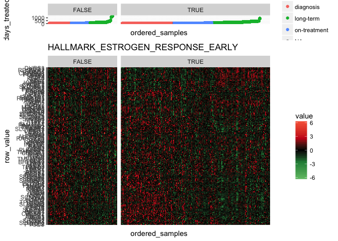

    ## 
    ## [[3]]


    ## 
    ## [[4]]


    ## 
    ## [[5]]


    ## 
    ## [[6]]


    ## 
    ## [[7]]


    ## 
    ## [[8]]


#### Diagnostic comparisons

``` r
lapply(hm_diagnosis, function(x) {
               eset <- dormset[, which(dormset$timepoint == "diagnosis")]
               heatmapPlot(eset, hallmarks[[x]], x)
      })
```

    ## [1] "scale_fill_gradient2 reminder : scale_fill_gradient2(high = '#d73027', mid = 'black', low = '#1a9850')"
    ## [1] "scale_fill_gradient2 reminder : scale_fill_gradient2(high = '#d73027', mid = 'black', low = '#1a9850')"
    ## [1] "scale_fill_gradient2 reminder : scale_fill_gradient2(high = '#d73027', mid = 'black', low = '#1a9850')"
    ## [1] "scale_fill_gradient2 reminder : scale_fill_gradient2(high = '#d73027', mid = 'black', low = '#1a9850')"
    ## [1] "scale_fill_gradient2 reminder : scale_fill_gradient2(high = '#d73027', mid = 'black', low = '#1a9850')"
    ## [1] "scale_fill_gradient2 reminder : scale_fill_gradient2(high = '#d73027', mid = 'black', low = '#1a9850')"
    ## [1] "scale_fill_gradient2 reminder : scale_fill_gradient2(high = '#d73027', mid = 'black', low = '#1a9850')"
    ## [1] "scale_fill_gradient2 reminder : scale_fill_gradient2(high = '#d73027', mid = 'black', low = '#1a9850')"
    ## [1] "scale_fill_gradient2 reminder : scale_fill_gradient2(high = '#d73027', mid = 'black', low = '#1a9850')"
    ## [1] "scale_fill_gradient2 reminder : scale_fill_gradient2(high = '#d73027', mid = 'black', low = '#1a9850')"
    ## [1] "scale_fill_gradient2 reminder : scale_fill_gradient2(high = '#d73027', mid = 'black', low = '#1a9850')"
    ## [1] "scale_fill_gradient2 reminder : scale_fill_gradient2(high = '#d73027', mid = 'black', low = '#1a9850')"
    ## [1] "scale_fill_gradient2 reminder : scale_fill_gradient2(high = '#d73027', mid = 'black', low = '#1a9850')"
    ## [1] "scale_fill_gradient2 reminder : scale_fill_gradient2(high = '#d73027', mid = 'black', low = '#1a9850')"
    ## [1] "scale_fill_gradient2 reminder : scale_fill_gradient2(high = '#d73027', mid = 'black', low = '#1a9850')"

    ## [[1]]

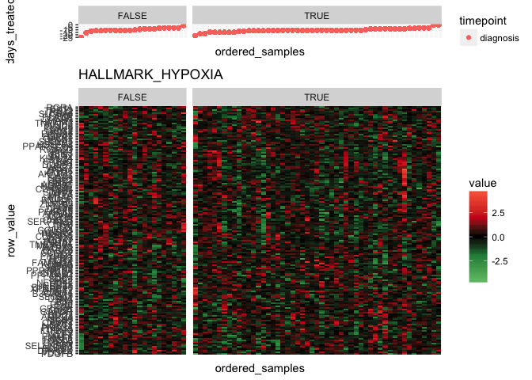

    ## 
    ## [[2]]


    ## 
    ## [[3]]

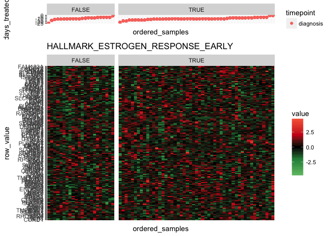

    ## 
    ## [[4]]

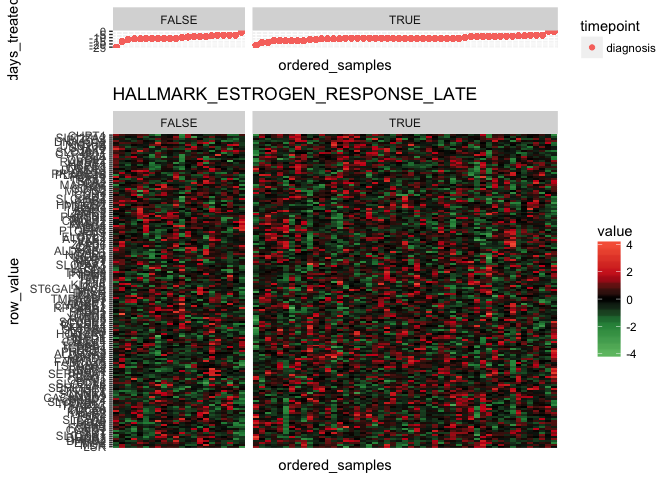

    ## 
    ## [[5]]


    ## 
    ## [[6]]

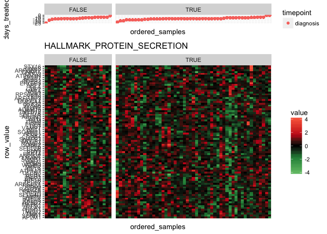

    ## 
    ## [[7]]

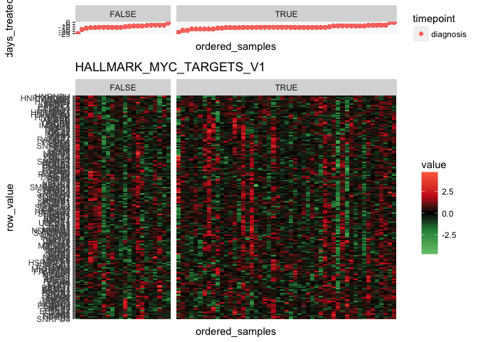

    ## 
    ## [[8]]


    ## 
    ## [[9]]

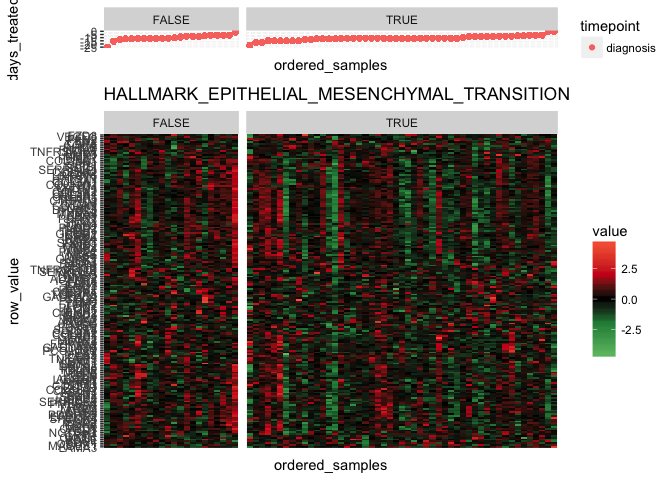

    ## 
    ## [[10]]

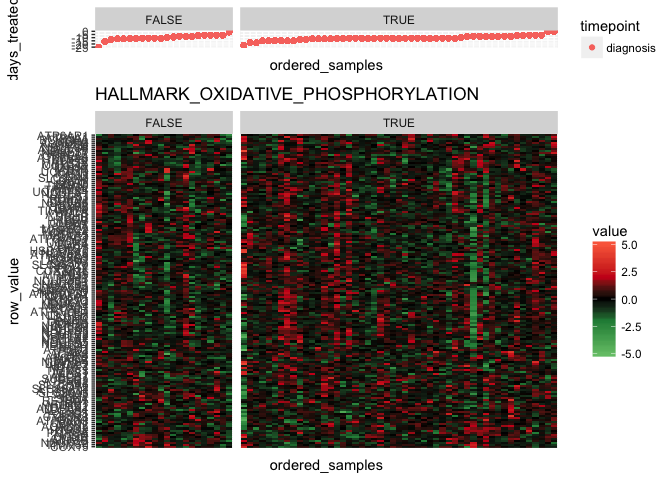

    ## 
    ## [[11]]


    ## 
    ## [[12]]

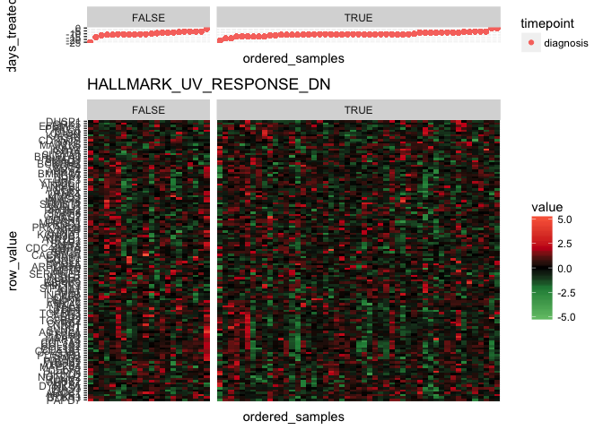

    ## 
    ## [[13]]


    ## 
    ## [[14]]


    ## 
    ## [[15]]

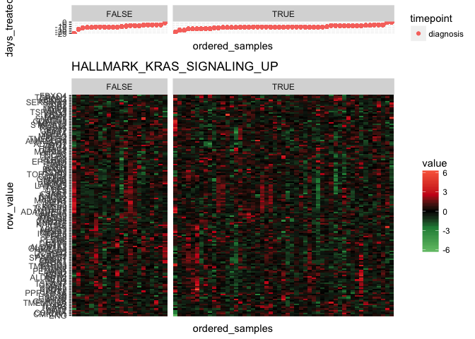

#### On-treatment comparisons

``` r
lapply(hm_on, function(x) {
               eset <- dormset[, which(dormset$timepoint == "on-treatment")]
               heatmapPlot(eset, hallmarks[[x]], x)
      })
```

    ## [1] "scale_fill_gradient2 reminder : scale_fill_gradient2(high = '#d73027', mid = 'black', low = '#1a9850')"
    ## [1] "scale_fill_gradient2 reminder : scale_fill_gradient2(high = '#d73027', mid = 'black', low = '#1a9850')"
    ## [1] "scale_fill_gradient2 reminder : scale_fill_gradient2(high = '#d73027', mid = 'black', low = '#1a9850')"

    ## [[1]]

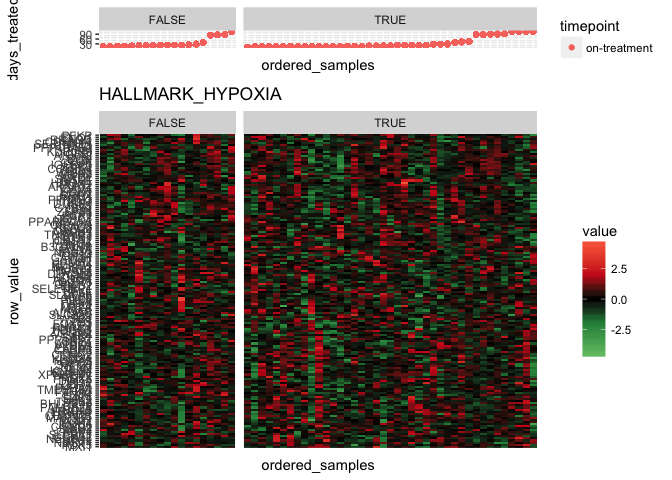

    ## 
    ## [[2]]

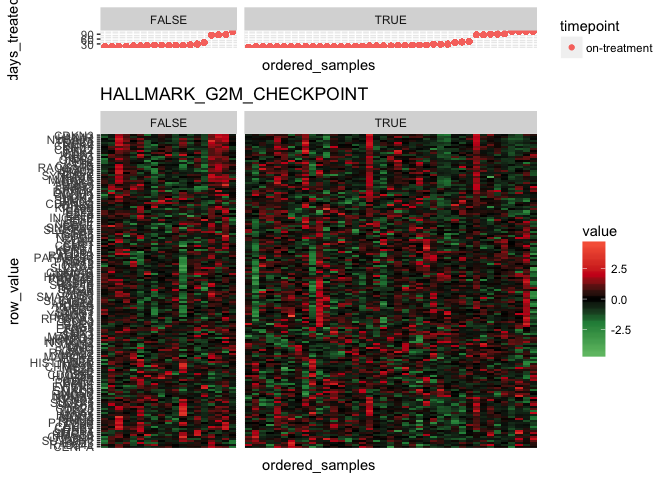

    ## 
    ## [[3]]

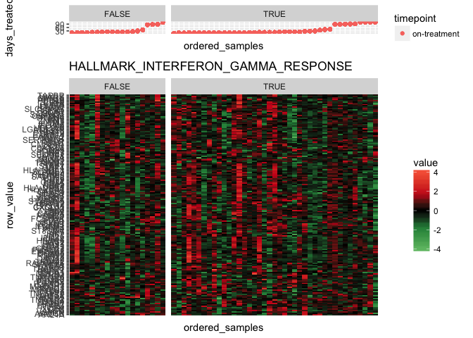

#### Long-term comparisons

``` r
lapply(hm_long, function(x) {
               eset <- dormset[, which(dormset$timepoint == "long-term")]
               heatmapPlot(eset, hallmarks[[x]], x)
      })
```

    ## [1] "scale_fill_gradient2 reminder : scale_fill_gradient2(high = '#d73027', mid = 'black', low = '#1a9850')"
    ## [1] "scale_fill_gradient2 reminder : scale_fill_gradient2(high = '#d73027', mid = 'black', low = '#1a9850')"
    ## [1] "scale_fill_gradient2 reminder : scale_fill_gradient2(high = '#d73027', mid = 'black', low = '#1a9850')"
    ## [1] "scale_fill_gradient2 reminder : scale_fill_gradient2(high = '#d73027', mid = 'black', low = '#1a9850')"
    ## [1] "scale_fill_gradient2 reminder : scale_fill_gradient2(high = '#d73027', mid = 'black', low = '#1a9850')"
    ## [1] "scale_fill_gradient2 reminder : scale_fill_gradient2(high = '#d73027', mid = 'black', low = '#1a9850')"
    ## [1] "scale_fill_gradient2 reminder : scale_fill_gradient2(high = '#d73027', mid = 'black', low = '#1a9850')"
    ## [1] "scale_fill_gradient2 reminder : scale_fill_gradient2(high = '#d73027', mid = 'black', low = '#1a9850')"
    ## [1] "scale_fill_gradient2 reminder : scale_fill_gradient2(high = '#d73027', mid = 'black', low = '#1a9850')"
    ## [1] "scale_fill_gradient2 reminder : scale_fill_gradient2(high = '#d73027', mid = 'black', low = '#1a9850')"
    ## [1] "scale_fill_gradient2 reminder : scale_fill_gradient2(high = '#d73027', mid = 'black', low = '#1a9850')"
    ## [1] "scale_fill_gradient2 reminder : scale_fill_gradient2(high = '#d73027', mid = 'black', low = '#1a9850')"
    ## [1] "scale_fill_gradient2 reminder : scale_fill_gradient2(high = '#d73027', mid = 'black', low = '#1a9850')"
    ## [1] "scale_fill_gradient2 reminder : scale_fill_gradient2(high = '#d73027', mid = 'black', low = '#1a9850')"
    ## [1] "scale_fill_gradient2 reminder : scale_fill_gradient2(high = '#d73027', mid = 'black', low = '#1a9850')"
    ## [1] "scale_fill_gradient2 reminder : scale_fill_gradient2(high = '#d73027', mid = 'black', low = '#1a9850')"
    ## [1] "scale_fill_gradient2 reminder : scale_fill_gradient2(high = '#d73027', mid = 'black', low = '#1a9850')"

    ## [[1]]

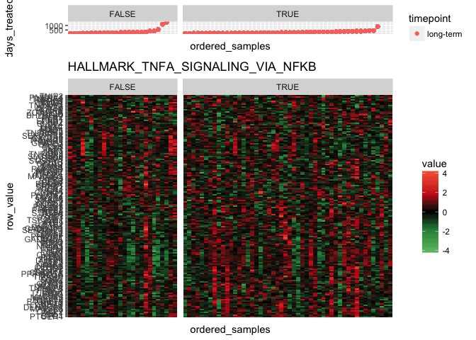

    ## 
    ## [[2]]

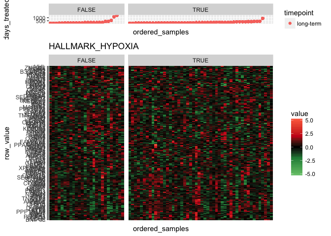

    ## 
    ## [[3]]

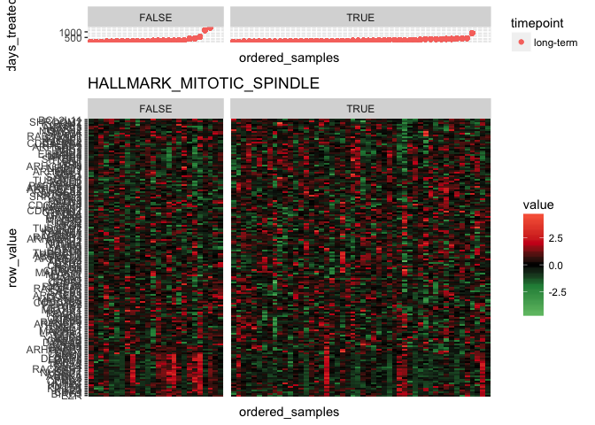

    ## 
    ## [[4]]


    ## 
    ## [[5]]

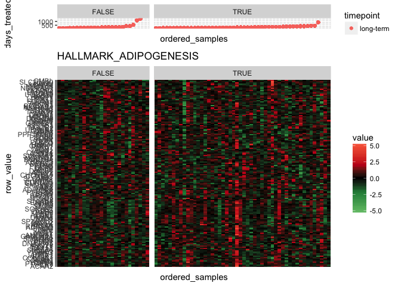

    ## 
    ## [[6]]

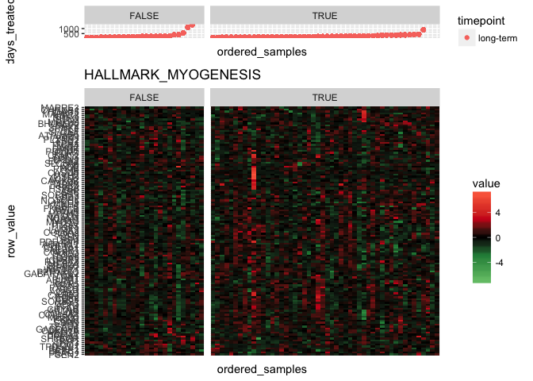

    ## 
    ## [[7]]

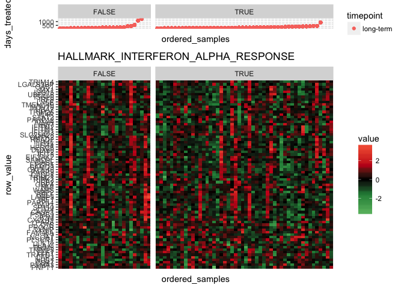

    ## 
    ## [[8]]

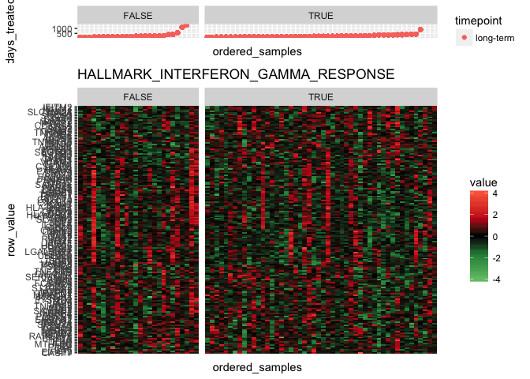

    ## 
    ## [[9]]


    ## 
    ## [[10]]


    ## 
    ## [[11]]

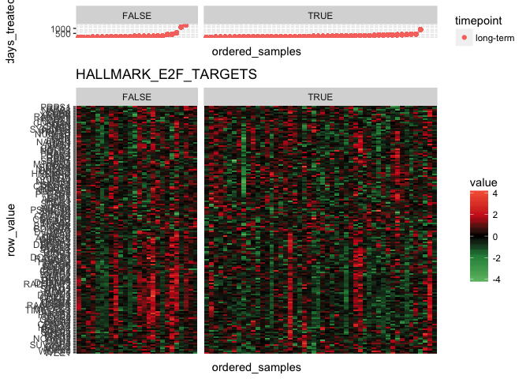

    ## 
    ## [[12]]


    ## 
    ## [[13]]


    ## 
    ## [[14]]


    ## 
    ## [[15]]

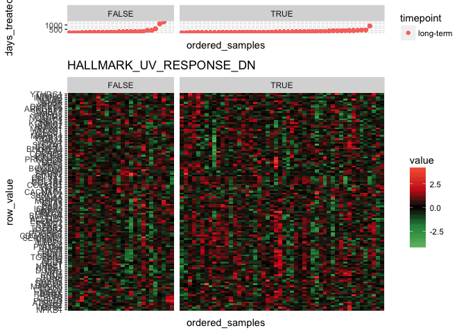

    ## 
    ## [[16]]


    ## 
    ## [[17]]


