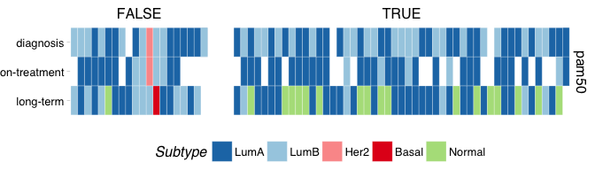

Dormancy Subtyping
================
Dominic Pearce

<!--
-->
``` r
library(tidyverse)
library(genefu)
library(Biobase)
library(ggthemes)
library(testthat)
source("/Volumes/igmm/sims-lab/Dominic/functions/idReplace.R")
```

``` r
#we'll want to remove multiple samples-per-timepoint for this analysis
dormset_base <- read_rds("../output/dormset.rds")
dormset <- dormset_base[, which(dormset_base$timepoint_split == "A" |
                                 is.na(dormset_base$timepoint_split))]
pData(dormset)[dormset$patient == 343,]$is_dormant <- TRUE
pData(dormset)[dormset$patient == 374,]$is_dormant <- TRUE
```

Convert to entrezgene ids (genefu requires this) and package as a new eset
--------------------------------------------------------------------------

``` r
xpr_entrez <- idReplace(exprs(dormset), 
                        id.in = "hgnc_symbol", 
                        id.out = "entrezgene")
phenoData <- new("AnnotatedDataFrame", 
                 data = pData(dormset),  
                 varMetadata = varMetadata(dormset))
dorm_ent <- new("ExpressionSet", 
                   exprs = as.matrix(xpr_entrez), 
                   phenoData = phenoData)
```

Calculate subtypes
------------------

``` r
ano_dfr <- data.frame(probe = row.names(dorm_ent), 
                      EntrezGene.ID = row.names(dorm_ent), 
                      rownames = row.names(dorm_ent))
ssp_lst <- list(ssp2003, ssp2006, pam50)
names(ssp_lst) <- c("sorlie2003", "hu2006", "pam50")
preds_base <- lapply(c("sorlie2003", "hu2006", "pam50"), function(ssp){
                        pred = intrinsic.cluster.predict(ssp_lst[[ssp]],
                                                         t(exprs(dorm_ent)), 
                                                         ano_dfr, 
                                                         do.mapping = TRUE)$subtype
                         dfr <- data.frame(pred = pred,
                                           method = ssp)
                         dfr$sample <- row.names(dfr)
                         dfr
                      }) %>% do.call(rbind, .)
row.names(preds_base) <- NULL

preds <-  preds_base[which(!grepl("e", preds_base$sample)),]
preds_mrg <- merge(preds, pData(dorm_ent), by.x = "sample", by.y = "xpr_id")
preds_mrg$time_tile <- factor(preds_mrg$timepoint, levels = c("long-term", "on-treatment", "diagnosis"))
preds_mrg$time_hist <- factor(preds_mrg$timepoint, levels = c("diagnosis", "on-treatment", "long-term"))

#order by time to final biopsy
tmp <- preds_mrg[which(preds_mrg$timepoint == "long-term" & preds_mrg$method == "pam50"),]
preds_mrg$patient_ord <- factor(preds_mrg$patient_id,
                                levels = tmp$patient_id[order(tmp$days_treated)])
test_that("reordering has worked correctly", {
        sapply(c(TRUE, FALSE), function(logical){
                asdf <- preds_mrg[which(preds_mrg$is_dormant == logical & 
                                        preds_mrg$timepoint == "long-term"),]
                all(diff(asdf$days_treated[order(asdf$patient_ord)]) >= 0, na.rm = TRUE)
        }) %>% all()
})

ggplot(preds_mrg[which(preds_mrg$method == "pam50" &
                       !is.na(preds_mrg$timepoint)),], 
               aes(x = patient_ord, y = time_tile, fill = pred)) + 
    geom_tile(width = 1, colour = "WHITE") + 
    scale_fill_manual(values=c("#1f78b4", "#a6cee3", "#fb9a99", "#e31a1c", "#b2df8a"), 
                    limits=c("LumA", "LumB", "Her2", "Basal", "Normal")) +
    facet_grid(method~is_dormant, scales = 'free', space = 'free') +
    labs(fill = "Subtype") + 
    ggthemes::theme_pander() + 
    theme(axis.title.y = element_blank(),
          axis.title.x = element_blank(),
          axis.text.x = element_blank(),
          axis.ticks.x = element_blank(),
          panel.spacing.x = unit(1.45, "lines"),
          legend.position = "bottom")
```



#### There is the potential for a greater trend towards Normal-like subtypes in the dormant class but actually with the larger dataset size this doesn't appear as pronounced as previously. So let's take a specific look at those patients, to double check that they are definitively desensitised or more borderline.

``` r
preds_mrg[which(!preds_mrg$is_dormant & 
                preds_mrg$timepoint == "long-term" &
                preds_mrg$method == "pam50" &
                preds_mrg$pred == "Normal"),]$patient_id
```

    ## [1] "299"

#### 343 and 374 should almost definitely be classified as dormant, so going back to the beginning of the document, hack-fixing this and repeating the calculations... fix properly soon

#### Only 299 remains questionable, it's uss pattern being 100-&gt;9-&gt;20-&gt;9, probably can't confidently call this actually dormant but if that 20 may is a mis-measurement...
