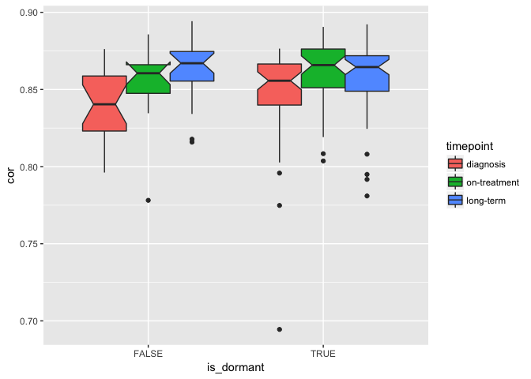

Timepoint correlations
================
Dominic Pearce

``` r
library(tidyverse)
library(Biobase)
library(reshape2)
library(ggforce)
source("/Volumes/igmm/sims-lab/Dominic/functions/mostVar.R")
```

``` r
dormset <- read_rds("../output/dormset.rds")
pData(dormset)[dormset$patient == 343,]$is_dormant <- TRUE
pData(dormset)[dormset$patient == 374,]$is_dormant <- TRUE
```

``` r
timepoints <- c("diagnosis", "on-treatment", "long-term")
```

#### Here we're going to characterise our patients based on the sampling timepoints - *diagnostic*, *on-treatment* and *long-term* - where we would anticipate desensitised patients to exhibit decreasing correlation at later timepoints, and vice versa for dormant patients.

#### We can also extend this categorical comparison to simply compare correlation vs. time on treatment.

``` r
corArrange <- function(eset){
    cor_mtx <- cor(exprs(eset))
    diag(cor_mtx) <- NA
    cor_vec <- data.frame(cor = colMeans(cor_mtx, na.rm = TRUE))
    cor_mrg <- merge(cor_vec, pData(eset), by = 0)
    cor_mrg$timepoint <- factor(cor_mrg$timepoint, levels = timepoints)
    cor_mrg
}
```

Inter-patient correlations
==========================

#### We can compare dormants to desensitiseds at each timepoint to determine at which point the two classes are most/least similar to one another.

``` r
tp_cor <- lapply(timepoints, function(biopsy){
                timeset <- dormset[, which(dormset$timepoint == biopsy)]
                dorm <- timeset[, which(timeset$is_dormant)] %>% exprs()
                dssn <- timeset[, which(!timeset$is_dormant)] %>% exprs()
                cor_dfr <- cor(dorm, dssn)
                mlt_dfr <- melt(cor_dfr)
                mlt_dfr$timepoint <- factor(biopsy, levels = timepoints)
                mlt_dfr
    }) %>% do.call(rbind, .)

ggplot(tp_cor, aes(x = timepoint, y = value)) + 
        geom_sina() +
        geom_boxplot(outlier.size = 0, notch = TRUE, alpha = 0.95) 
```


#### On-treatment vs. long-term significance is...

``` r
tp_cor[which(tp_cor$timepoint != "diagnosis"),] %>% wilcox.test(value ~ timepoint, data = .)
```

    ## 
    ##  Wilcoxon rank sum test with continuity correction
    ## 
    ## data:  value by timepoint
    ## W = 411750, p-value = 0.5757
    ## alternative hypothesis: true location shift is not equal to 0

#### We can also perform this analysis independently for dormant and desensitiseds, calculating the correlation again within timepoints but also within dormancy statuses.

``` r
interCors <- function(eset){
    lapply(timepoints, function(biopsy){
               timeset <- eset[, which(eset$timepoint == biopsy)]
               lapply(c(TRUE, FALSE), function(x){
                              statusset <- timeset[, which(timeset$is_dormant == x)]
                              corArrange(statusset)
               }) %>% do.call(rbind, .)
    }) %>% do.call(rbind, .)
}

inter_cor <- interCors(dormset)
ggplot(inter_cor, aes(x = is_dormant, y = cor, fill = timepoint)) + geom_boxplot(notch = TRUE)
```



``` r
aov_lst <- lapply(c(TRUE, FALSE), function(x){
               aov(cor ~ timepoint, data = inter_cor[which(inter_cor$is_dormant == x),]) %>%
                       summary()
    })
names(aov_lst) <- c("Dormant", "Desensitised")
aov_lst
```

    ## $Dormant
    ##              Df  Sum Sq   Mean Sq F value Pr(>F)  
    ## timepoint     2 0.00419 0.0020964   3.241 0.0419 *
    ## Residuals   148 0.09572 0.0006468                 
    ## ---
    ## Signif. codes:  0 '***' 0.001 '**' 0.01 '*' 0.05 '.' 0.1 ' ' 1
    ## 
    ## $Desensitised
    ##             Df   Sum Sq   Mean Sq F value  Pr(>F)   
    ## timepoint    2 0.005329 0.0026644   5.337 0.00762 **
    ## Residuals   55 0.027460 0.0004993                   
    ## ---
    ## Signif. codes:  0 '***' 0.001 '**' 0.01 '*' 0.05 '.' 0.1 ' ' 1

``` r
wilcox.test(cor ~ is_dormant, data = inter_cor[which(inter_cor$timepoint == "diagnosis" & 
                                                     !is.na(inter_cor$is_dormant)), ])
```

    ## 
    ##  Wilcoxon rank sum test with continuity correction
    ## 
    ## data:  cor by is_dormant
    ## W = 365, p-value = 0.04189
    ## alternative hypothesis: true location shift is not equal to 0

Intra-patient correlations
--------------------------

#### Intra-status correlations

``` r
corByStatus <- function(eset){
    lapply(c(TRUE, FALSE), function(logical){
               statusset <- eset[, which(eset$is_dormant == logical)]
               lapply(unique(statusset$patient), function(patient){
                          patientset <- statusset[, which(statusset$patient == patient)]
                          corArrange(patientset)
               }) %>% do.call(rbind, .)
    }) %>% do.call(rbind, .)
}

all_cor <- corByStatus(dormset)
```

``` r
ggplot(all_cor, aes(x = is_dormant, y = cor)) + 
    geom_boxplot(outlier.size = 0, notch = TRUE) + 
    geom_sina()
```


``` r
ggplot(all_cor, aes(x = is_dormant, y = cor)) + 
    geom_boxplot(outlier.size = 0, notch = TRUE) + 
    geom_sina() + 
    facet_wrap(~timepoint, nrow = 1)
```


``` r
ggplot(all_cor, aes(x = timepoint, y = cor)) + 
    geom_boxplot(outlier.size = 0, notch = TRUE) + 
    geom_sina() + 
    facet_wrap(~is_dormant)
```


#### Intra-status correlations over time

``` r
ggplot(all_cor, aes(x = days_treated, y = cor, colour = is_dormant)) + 
    geom_point() + 
    geom_smooth()
```


``` r
ggplot(all_cor, aes(x = days_treated, y = cor, colour = is_dormant)) + 
    geom_point() + 
    geom_smooth() +
    xlim(0, 500)
```


#### Intra-status & intra-timepoint correlations

``` r
timepoint_cor <- lapply(timepoints, function(timepoint){
                            dfr <- corByStatus(dormset[, which(dormset$timepoint != timepoint)])
                            dfr$cor_comp <- factor(paste0(unique(dfr$timepoint), collapse = "-"),
                                                   levels = c("diagnosis-on-treatment", 
                                                              "diagnosis-long-term",
                                                              "on-treatment-long-term"))
                            dfr
}) %>% do.call(rbind, .)

ggplot(timepoint_cor, aes(x = cor_comp, y = cor)) + 
    geom_boxplot(outlier.size = 0, notch = TRUE) +
    geom_sina() +
    facet_wrap(~is_dormant, nrow = 1)
```


``` r
ggplot(timepoint_cor, aes(x = is_dormant, y = cor)) + 
    geom_boxplot(outlier.size = 0, notch = TRUE) +
    geom_sina() +
    facet_wrap(~cor_comp, nrow = 1)
```


#### Intra-status & intra-timepoint correlations

``` r
ggplot(timepoint_cor, aes(x = days_treated, y = cor, colour = is_dormant)) +
    geom_point() +
    geom_smooth()
```


``` r
ggplot(timepoint_cor, aes(x = days_treated, y = cor, colour = is_dormant)) +
    geom_point() +
    geom_smooth() +
    xlim(0, 500)
```


#### Check that dormancy status is correct...

``` r
pheno <- pData(dormset)
library(reshape2)
xpr <- melt(exprs(dormset))

mrg <- merge(xpr, pheno, by.x = 'Var2', by.y = 'sample_id')

mrg$timepoint <- factor(mrg$timepoint, levels = timepoints)

ggplot(mrg[which(mrg$Var1 %in% c("MKI67", "MCM2", "PCNA")),], aes(x = timepoint, y = value)) +
    geom_boxplot() +
    facet_grid(Var1~is_dormant, scales = 'free')
```


<!-- I'm not convinced this was the best way to perform this comparison (compared to the inter-patient correlations above, so I've removed it for now)
#### How do patients' intra-correlations compare to overall correlation between all patients/samples?


```r
interCorByStatus <- function(eset){
    lapply(c(TRUE, FALSE), function(logical){
               statusset <- eset[, which(eset$is_dormant == logical)]
               corArrange(statusset)
    }) %>% do.call(rbind, .)
}

intercor <- interCorByStatus(dormset)
inter_intra <- rbind(intercor, all_cor)
inter_intra$comparison <- rep(c("inter", "intra"), each = 218)

ggplot(inter_intra, aes(x = comparison, y = cor)) +
    geom_boxplot(notch = TRUE) +
    geom_sina() +
    facet_wrap(~is_dormant)
```


```r
ggplot(inter_intra, aes(x = is_dormant, y = cor)) +
    geom_boxplot(notch = TRUE) +
    geom_sina() +
    facet_wrap(~comparison)
```


-->
