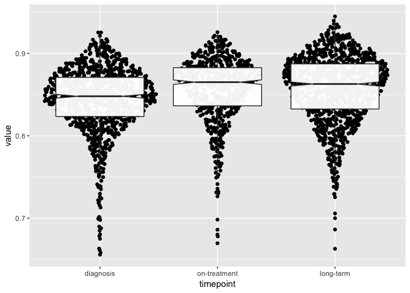

Timepoint correlations
================
Dominic Pearce

``` r
library(tidyverse)
library(Biobase)
library(ggforce)
source("/Volumes/igmm/sims-lab/Dominic/functions/mostVar.R")
```

``` r
dormset <- read_rds("../output/dormset.rds")
```

#### Here we're going to characterise our patients based on the sampling timepoints - *diagnostic*, *on-treatment* and *long-term* - where we would anticipate desensitised patients to exhibit decreasing correlation at later timepoints, and vice versa for dormant patients.

#### We can also extend this categorical comparison to simply compare correlation vs. time on treatment.

#### All correlations are per-sample and are calculated in a paired manner for each patient.

``` r
corArrange <- function(eset){
    cor_mtx <- cor(exprs(eset))
    diag(cor_mtx) <- NA
    cor_vec <- data.frame(cor = colMeans(cor_mtx, na.rm = TRUE))
    cor_mrg <- merge(cor_vec, pData(eset), by = 0)
    cor_mrg$timepoint <- factor(cor_mrg$timepoint, levels = c("diagnosis", "on-treatment", "long-term"))
    cor_mrg
}

corByStatus <- function(eset){
    lapply(c(TRUE, FALSE), function(logical){
               statusset <- eset[, which(eset$is_dormant == logical)]
               lapply(unique(statusset$patient), function(patient){
                          patientset <- statusset[, which(statusset$patient == patient)]
                          corArrange(patientset)
               }) %>% do.call(rbind, .)
    }) %>% do.call(rbind, .)
}
```

#### Intra-status correlations

``` r
all_cor <- corByStatus(dormset)

ggplot(all_cor, aes(x = is_dormant, y = cor)) + 
    geom_boxplot(outlier.size = 0, notch = TRUE) + 
    geom_sina()
```



``` r
ggplot(all_cor, aes(x = is_dormant, y = cor)) + 
    geom_boxplot(outlier.size = 0, notch = TRUE) + 
    geom_sina() + 
    facet_wrap(~timepoint, nrow = 1)
```


``` r
ggplot(all_cor, aes(x = timepoint, y = cor)) + 
    geom_boxplot(outlier.size = 0, notch = TRUE) + 
    geom_sina() + 
    facet_wrap(~is_dormant)
```


#### Intra-status correlations over time

``` r
ggplot(all_cor, aes(x = days_treated, y = cor, colour = is_dormant)) + 
    geom_point() + 
    geom_smooth()
```


``` r
ggplot(all_cor, aes(x = days_treated, y = cor, colour = is_dormant)) + 
    geom_point() + 
    geom_smooth() +
    xlim(0, 500)
```


#### Intra-status & intra-timepoint correlations

``` r
timepoint_cor <- lapply(c("diagnosis", "on-treatment", "long-term"), function(timepoint){
                            dfr <- corByStatus(dormset[, which(dormset$timepoint != timepoint)])
                            dfr$cor_comp <- factor(paste0(unique(dfr$timepoint), collapse = "-"),
                                                   levels = c("diagnosis-on-treatment", 
                                                              "diagnosis-long-term",
                                                              "on-treatment-long-term"))
                            dfr
}) %>% do.call(rbind, .)

ggplot(timepoint_cor, aes(x = cor_comp, y = cor)) + 
    geom_boxplot(outlier.size = 0, notch = TRUE) +
    geom_sina() +
    facet_wrap(~is_dormant, nrow = 1)
```


``` r
ggplot(timepoint_cor, aes(x = is_dormant, y = cor)) + 
    geom_boxplot(outlier.size = 0, notch = TRUE) +
    geom_sina() +
    facet_wrap(~cor_comp, nrow = 1)
```


#### Intra-status & intra-timepoint correlations

``` r
ggplot(timepoint_cor, aes(x = days_treated, y = cor, colour = is_dormant)) +
    geom_point() +
    geom_smooth()
```


``` r
ggplot(timepoint_cor, aes(x = days_treated, y = cor, colour = is_dormant)) +
    geom_point() +
    geom_smooth() +
    xlim(0, 500)
```


#### Check that dormancy status is correct...

``` r
pheno <- pData(dormset)
library(reshape2)
xpr <- melt(exprs(dormset))

mrg <- merge(xpr, pheno, by.x = 'Var2', by.y = 'sample_id')

mrg$timepoint <- factor(mrg$timepoint, levels = c("diagnosis", "on-treatment", "long-term"))

ggplot(mrg[which(mrg$Var1 %in% c("MKI67", "MCM2", "PCNA")),], aes(x = timepoint, y = value)) +
    geom_boxplot() +
    facet_grid(Var1~is_dormant, scales = 'free')
```


