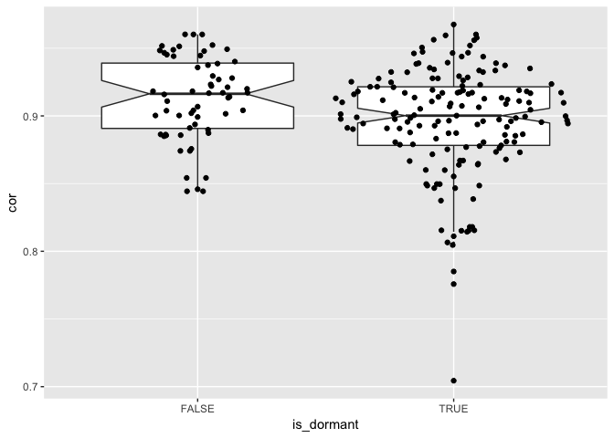

Timepoint correlations
================
Dominic Pearce

``` r
library(tidyverse)
library(Biobase)
library(ggforce)
source("/Volumes/igmm/sims-lab/Dominic/functions/mostVar.R")
```

``` r
dormset <- read_rds("../output/dormset.rds")
```

#### Here we're going to characterise our patients based on the sampling timepoints - *diagnostic*, *on-treatment* and *long-term* - where we would anticipate desensitised patients to exhibit decreasing correlation at later timepoints, and vice versa for dormant patients.

#### We can also extend this categorical comparison to simply compare correlation vs. time on treatment.

#### All correlations are per-sample and are calculated in a paired manner for each patient.

``` r
corArrange <- function(eset){
    cor_mtx <- cor(exprs(eset))
    diag(cor_mtx) <- NA
    cor_vec <- data.frame(cor = colMeans(cor_mtx, na.rm = TRUE))
    cor_mrg <- merge(cor_vec, pData(eset), by = 0)
    cor_mrg$timepoint <- factor(cor_mrg$timepoint, levels = c("diagnosis", "on-treatment", "long-term"))
    cor_mrg
}

corByStatus <- function(eset){
    lapply(c(TRUE, FALSE), function(logical){
               statusset <- eset[, which(eset$is_dormant == logical)]
               lapply(unique(statusset$patient), function(patient){
                          patientset <- statusset[, which(statusset$patient == patient)]
                          corArrange(patientset)
               }) %>% do.call(rbind, .)
    }) %>% do.call(rbind, .)
}
```

Inter-patient correlations
==========================

``` r
asdf <- function(eset){
    lapply(c("diagnosis", "on-treatment", "long-term"), function(logical){
               timeset <- eset[, which(eset$timepoint == logical)]
               lapply(c(TRUE, FALSE), function(x){
                              statusset <- timeset[, which(timeset$is_dormant == x)]
                              corArrange(statusset)
               }) %>% do.call(rbind, .)
    }) %>% do.call(rbind, .)
}

all_cor <- corByStatus(dormset)

inter_cor <- asdf(dormset)
ggplot(inter_cor, aes(x = is_dormant, y = cor, fill = timepoint)) + geom_boxplot(notch = TRUE)
```


``` r
lapply(c(TRUE, FALSE), function(x){
               aov(cor ~ timepoint, data = inter_cor[which(inter_cor$is_dormant == x),]) %>%
                       summary()
    })
```

    ## [[1]]
    ##              Df  Sum Sq   Mean Sq F value Pr(>F)  
    ## timepoint     2 0.00329 0.0016467   2.444 0.0906 .
    ## Residuals   139 0.09366 0.0006738                 
    ## ---
    ## Signif. codes:  0 '***' 0.001 '**' 0.01 '*' 0.05 '.' 0.1 ' ' 1
    ## 
    ## [[2]]
    ##             Df   Sum Sq   Mean Sq F value  Pr(>F)   
    ## timepoint    2 0.005716 0.0028582   6.121 0.00369 **
    ## Residuals   64 0.029884 0.0004669                   
    ## ---
    ## Signif. codes:  0 '***' 0.001 '**' 0.01 '*' 0.05 '.' 0.1 ' ' 1

<!-- I don't think this is particularly informative

```r
#when interpatient correlations are calculated separately by status and separately by timepoint, there is no significant change in corelataion for dorments but there is for desensitiseds. This is mostly driven by the fact that desensitised diagnostic samples are not well correlated with one another.

#So let's compare only diagnostic samples

diagnoset <- dormset[, which(dormset$timepoint == "diagnosis")]

corArrange(diagnoset) %>%
        ggplot(aes(x = timepoint, y = cor)) + 
        geom_boxplot(aes(fill = is_dormant), width = 0.3, notch = TRUE) + 
        geom_boxplot(alpha = 0.2, width = 0.08) 
```


```r
wilcox.test(cor ~ is_dormant, data = inter_cor[which(inter_cor$timepoint == "diagnosis"),]) 
```

```
## 
##  Wilcoxon rank sum test with continuity correction
## 
## data:  cor by is_dormant
## W = 420, p-value = 0.0912
## alternative hypothesis: true location shift is not equal to 0
```
-->
Intra-patient correlations
--------------------------

#### Intra-status correlations

``` r
ggplot(all_cor, aes(x = is_dormant, y = cor)) + 
    geom_boxplot(outlier.size = 0, notch = TRUE) + 
    geom_sina()
```


``` r
ggplot(all_cor, aes(x = is_dormant, y = cor)) + 
    geom_boxplot(outlier.size = 0, notch = TRUE) + 
    geom_sina() + 
    facet_wrap(~timepoint, nrow = 1)
```


``` r
ggplot(all_cor, aes(x = timepoint, y = cor)) + 
    geom_boxplot(outlier.size = 0, notch = TRUE) + 
    geom_sina() + 
    facet_wrap(~is_dormant)
```


#### Intra-status correlations over time

``` r
ggplot(all_cor, aes(x = days_treated, y = cor, colour = is_dormant)) + 
    geom_point() + 
    geom_smooth()
```


``` r
ggplot(all_cor, aes(x = days_treated, y = cor, colour = is_dormant)) + 
    geom_point() + 
    geom_smooth() +
    xlim(0, 500)
```


#### Intra-status & intra-timepoint correlations

``` r
timepoint_cor <- lapply(c("diagnosis", "on-treatment", "long-term"), function(timepoint){
                            dfr <- corByStatus(dormset[, which(dormset$timepoint != timepoint)])
                            dfr$cor_comp <- factor(paste0(unique(dfr$timepoint), collapse = "-"),
                                                   levels = c("diagnosis-on-treatment", 
                                                              "diagnosis-long-term",
                                                              "on-treatment-long-term"))
                            dfr
}) %>% do.call(rbind, .)

ggplot(timepoint_cor, aes(x = cor_comp, y = cor)) + 
    geom_boxplot(outlier.size = 0, notch = TRUE) +
    geom_sina() +
    facet_wrap(~is_dormant, nrow = 1)
```



``` r
ggplot(timepoint_cor, aes(x = is_dormant, y = cor)) + 
    geom_boxplot(outlier.size = 0, notch = TRUE) +
    geom_sina() +
    facet_wrap(~cor_comp, nrow = 1)
```


#### Intra-status & intra-timepoint correlations

``` r
ggplot(timepoint_cor, aes(x = days_treated, y = cor, colour = is_dormant)) +
    geom_point() +
    geom_smooth()
```


``` r
ggplot(timepoint_cor, aes(x = days_treated, y = cor, colour = is_dormant)) +
    geom_point() +
    geom_smooth() +
    xlim(0, 500)
```


#### Check that dormancy status is correct...

``` r
pheno <- pData(dormset)
library(reshape2)
xpr <- melt(exprs(dormset))

mrg <- merge(xpr, pheno, by.x = 'Var2', by.y = 'sample_id')

mrg$timepoint <- factor(mrg$timepoint, levels = c("diagnosis", "on-treatment", "long-term"))

ggplot(mrg[which(mrg$Var1 %in% c("MKI67", "MCM2", "PCNA")),], aes(x = timepoint, y = value)) +
    geom_boxplot() +
    facet_grid(Var1~is_dormant, scales = 'free')
```


<!-- I'm not convinced this was the best way to perform this comparison (compared to the inter-patient correlations above, so I've removed it for now)
#### How do patients' intra-correlations compare to overall correlation between all patients/samples?


```r
interCorByStatus <- function(eset){
    lapply(c(TRUE, FALSE), function(logical){
               statusset <- eset[, which(eset$is_dormant == logical)]
               corArrange(statusset)
    }) %>% do.call(rbind, .)
}

intercor <- interCorByStatus(dormset)
inter_intra <- rbind(intercor, all_cor)
inter_intra$comparison <- rep(c("inter", "intra"), each = 218)

ggplot(inter_intra, aes(x = comparison, y = cor)) +
    geom_boxplot(notch = TRUE) +
    geom_sina() +
    facet_wrap(~is_dormant)
```


```r
ggplot(inter_intra, aes(x = is_dormant, y = cor)) +
    geom_boxplot(notch = TRUE) +
    geom_sina() +
    facet_wrap(~comparison)
```


-->
