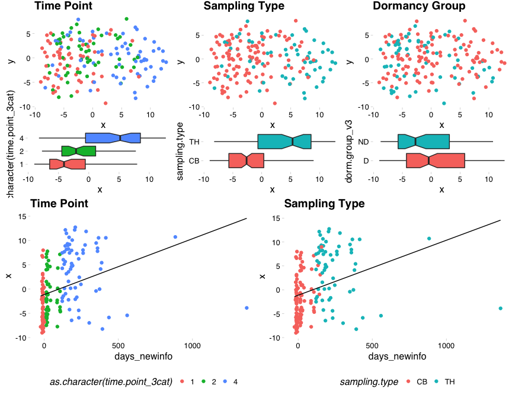
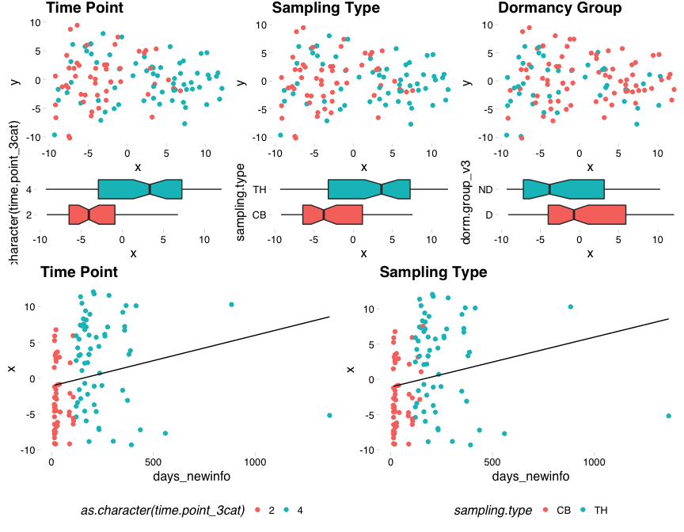
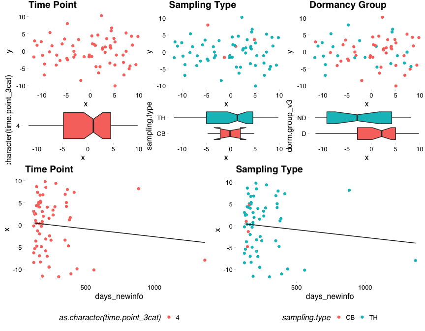
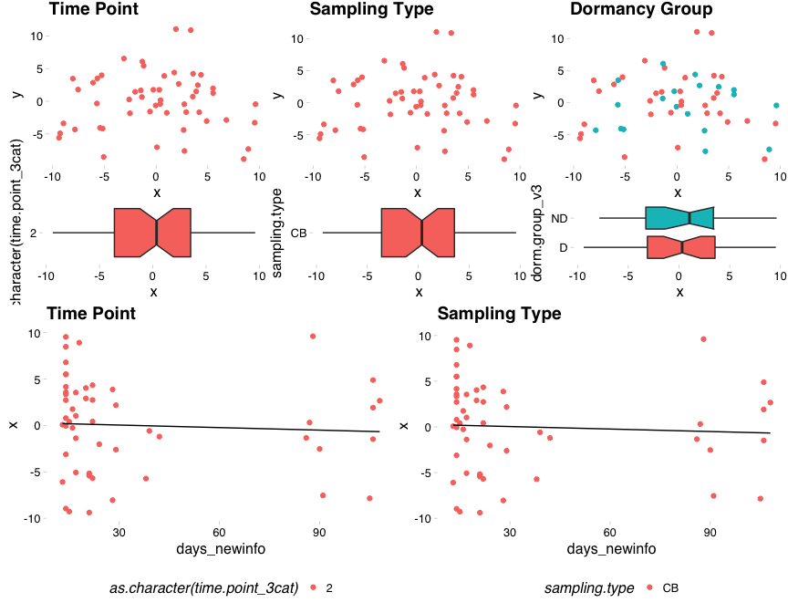
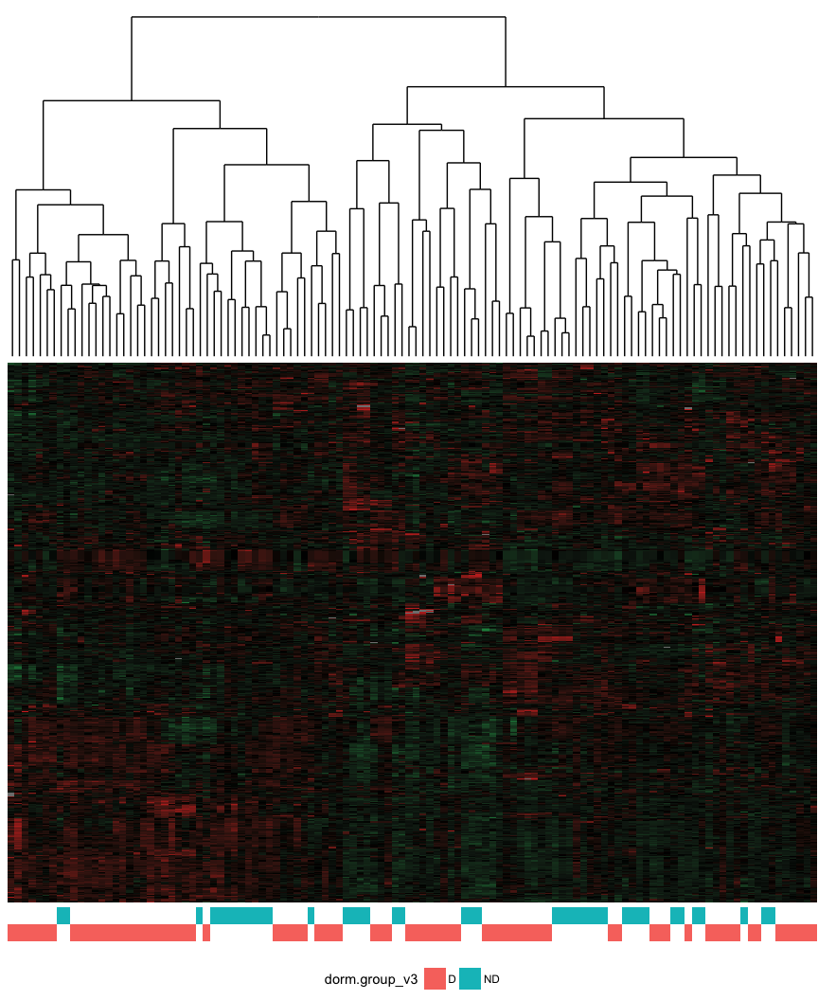
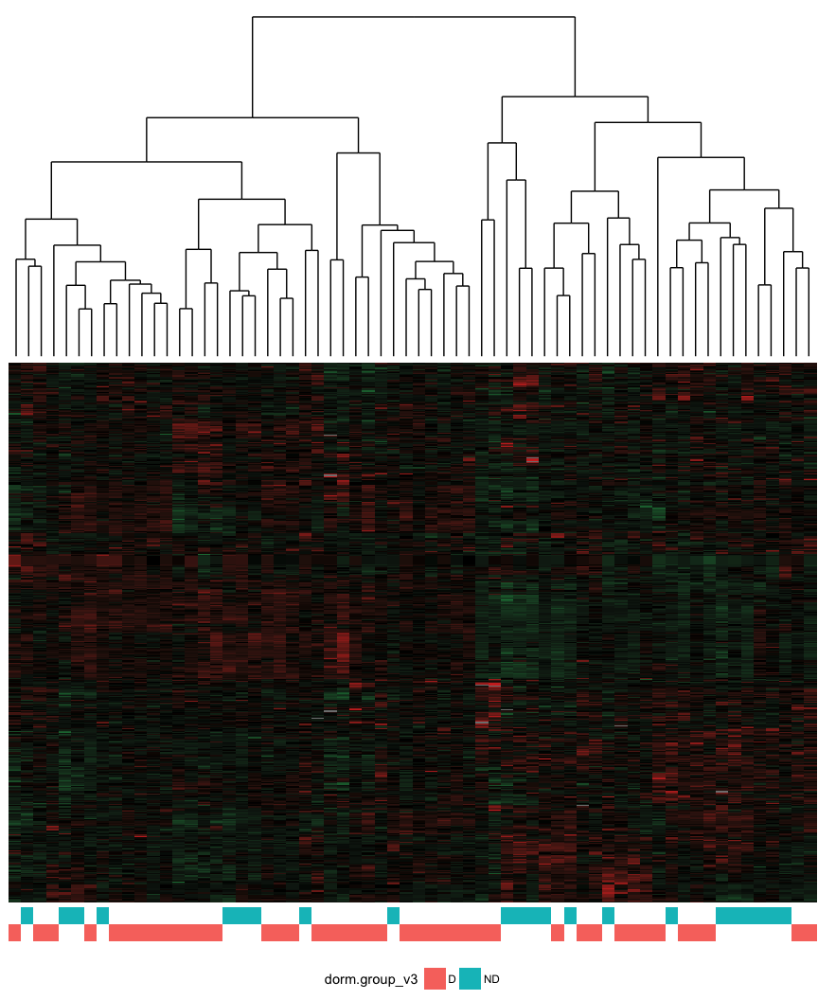

Dormancy - Unsupervised Analysis
================
Dominic Pearce

``` r
library(tidyverse)
library(testthat)
library(Biobase)
library(ggthemes)
library(ggdendro)
library(knitr)
library(broom)
library(viridis)
library(cowplot); theme_set(theme_grey())
source("./../../../functions/library/mdsArrange.R")
source("./../../../functions/mostVar.R")
source("./../../../functions/library/heatmapArrange.R")
```

``` r
#dorm_base <- read_rds("../output/1_Dorm_120_hgnc_v2_3cat.Rds")
#remove Exluded samples immediately and write
#dorm <- dorm_base[, dorm_base$dorm.group_v3 != "Excl"]
#write_rds(dorm, "./output/dorm.rds")
dorm <- read_rds("../output/dorm.rds")
```

### Dormancy comparison plotting function

``` r
dormPlot <- function(mds_input){
    p1a <- ggplot(mds_input, aes(x = x, y = y, colour = as.character(time.point_3cat))) + 
        geom_point() + 
        ggtitle("Time Point") + 
        theme_pander() + 
        theme(legend.position = 'none')
    p1b <- ggplot(mds_input, aes(x = as.character(time.point_3cat), y = x, 
                                 fill = as.character(time.point_3cat))) +
        geom_boxplot(notch = TRUE) + 
        theme_pander() + 
        theme(legend.position = 'none') + 
        coord_flip()

    p2a <- ggplot(mds_input, aes(x = x, y = y, colour = sampling.type)) + 
        geom_point() + 
        ggtitle("Sampling Type") + 
        theme_pander() + 
        theme(legend.position = 'none')
    p2b <- ggplot(mds_input, aes(x = sampling.type, y = x, fill = sampling.type)) +
        geom_boxplot(notch = TRUE) + 
        theme_pander() + 
        theme(legend.position = 'none') + 
        coord_flip()
    
    p3a <- ggplot(mds_input, aes(x = x, y = y, colour = dorm.group_v3)) + 
        geom_point() + 
        ggtitle("Dormancy Group") + 
        theme_pander() + 
        theme(legend.position = 'none')
    p3b <- ggplot(mds_input, aes(x = dorm.group_v3, y = x, fill = dorm.group_v3)) +
        geom_boxplot(notch = TRUE) + 
        theme_pander() + 
        theme(legend.position = 'none') + 
        coord_flip()
    
    p4 <- ggplot(mds_input, aes(y = x, x = days_newinfo, colour = as.character(time.point_3cat))) + 
        geom_point() + 
        stat_smooth(method = 'lm', aes(group = 1), size = 0.5, se = FALSE, colour = "BLACK") +
        ggtitle("Time Point") + 
        theme_pander() + 
        theme(legend.position = 'bottom')
    p5 <- ggplot(mds_input, aes(y = x, x = days_newinfo, colour = sampling.type)) + 
        geom_point() +
        stat_smooth(method = 'lm', aes(group = 1), size = 0.5, se = FALSE, colour = "BLACK") +
        ggtitle("Sampling Type") + 
        theme_pander() + 
        theme(legend.position = 'bottom')
    
    p1 <- plot_grid(p1a, p1b, ncol = 1, rel_heights = c(2, 1))
    p2 <- plot_grid(p2a, p2b, ncol = 1, rel_heights = c(2, 1))
    p3 <- plot_grid(p3a, p3b, ncol = 1, rel_heights = c(2, 1))
    pg1 <- plot_grid(p1, p2, p3, nrow = 1)
    pg2 <- plot_grid(p4, p5, nrow = 1)
    plot_grid(pg1, pg2, ncol = 1)
}
```

### Calculate most variant genes using all samples and also excluding pre-treatment timepoint and subset esets

#### All samples

``` r
mv_genes <- mostVar(exprs(dorm), 500) %>% row.names()
mv_dorm <- dorm[mv_genes,]
```

#### Treated samples

``` r
tre <- dorm[, dorm$time.point_3cat != 1]
mv_genes_tre <- mostVar(exprs(tre), 500) %>% row.names()
mv_tre <- tre[mv_genes_tre,]
```

### Arrange All and Treated data for MDS. Additionally, using the two MV500s above, prepare MDS using only timepoint 4 samples.

``` r
mds_dorm <- merge(mdsArrange(exprs(mv_dorm)), pData(mv_dorm), by.x = "ids", by.y = 0)
mds_tre <- merge(mdsArrange(exprs(mv_tre)), pData(mv_tre), by.x = "ids", by.y = 0)

mds_dorm_4 <- merge(mdsArrange(exprs(mv_dorm[, mv_dorm$time.point_3cat == 4])), pData(mv_dorm), by.x = "ids", by.y = 0)
mds_tre_4 <- merge(mdsArrange(exprs(mv_tre[, mv_tre$time.point_3cat == 4])), pData(mv_tre), by.x = "ids", by.y = 0)
```

### Plots

#### All Sample

``` r
dormPlot(mds_dorm)
```



``` r
wilcox.test(x ~ dorm.group_v3, data = mds_dorm) %>% tidy() %>% kable()
```

|  statistic|    p.value| method                                            | alternative |
|----------:|----------:|:--------------------------------------------------|:------------|
|       4046|  0.0476494| Wilcoxon rank sum test with continuity correction | two.sided   |

``` r
t.test(x ~ dorm.group_v3, data = mds_dorm) %>% tidy() %>% kable()
```

|  estimate|  estimate1|  estimate2|  statistic|    p.value|  parameter|    conf.low|  conf.high| method                  | alternative |
|---------:|----------:|----------:|----------:|----------:|----------:|-----------:|----------:|:------------------------|:------------|
|  1.733135|  0.5976329|  -1.135503|   1.924145|  0.0566006|   125.4848|  -0.0494536|   3.515725| Welch Two Sample t-test | two.sided   |

``` r
lm(x ~ days_newinfo, data = mds_dorm) %>% summary() %>% tidy() %>% kable()
```

| term          |    estimate|  std.error|  statistic|    p.value|
|:--------------|-----------:|----------:|----------:|----------:|
| (Intercept)   |  -1.1408184|  0.4845756|  -2.354263|  0.0196882|
| days\_newinfo |   0.0114974|  0.0025207|   4.561255|  0.0000096|

#### Treated

``` r
dormPlot(mds_tre)
```



``` r
wilcox.test(x ~ dorm.group_v3, data = mds_tre) %>% tidy() %>% kable()
```

|  statistic|    p.value| method                                            | alternative |
|----------:|----------:|:--------------------------------------------------|:------------|
|       1949|  0.0176132| Wilcoxon rank sum test with continuity correction | two.sided   |

``` r
t.test(x ~ dorm.group_v3, data = mds_tre) %>% tidy() %>% kable()
```

|  estimate|  estimate1|  estimate2|  statistic|    p.value|  parameter|   conf.low|  conf.high| method                  | alternative |
|---------:|----------:|----------:|----------:|----------:|----------:|----------:|----------:|:------------------------|:------------|
|  2.574964|  0.9101164|  -1.664847|   2.183129|  0.0319987|   78.90216|  0.2272164|   4.922711| Welch Two Sample t-test | two.sided   |

``` r
lm(x ~ days_newinfo, data = mds_tre) %>% summary() %>% tidy() %>% kable()
```

| term          |    estimate|  std.error|  statistic|    p.value|
|:--------------|-----------:|----------:|----------:|----------:|
| (Intercept)   |  -1.0910100|  0.7343613|  -1.485658|  0.1401297|
| days\_newinfo |   0.0070797|  0.0031208|   2.268561|  0.0251775|

#### Note: This is not significant if the treated mv500 genes are used to subset all samples (i.e. including pre-treatment samples). I would guess this is because treatment is overshadowing everything else that it becomes difficult to see the dormant/desnesitised signal.

#### All sample mv500, timepoint 4 plot subset

``` r
dormPlot(mds_dorm_4)
```



``` r
wilcox.test(x ~ dorm.group_v3, data = mds_dorm_4) %>% tidy() %>% kable() 
```

|  statistic|    p.value| method                 | alternative |
|----------:|----------:|:-----------------------|:------------|
|        606|  0.0418762| Wilcoxon rank sum test | two.sided   |

``` r
t.test(x ~ dorm.group_v3, data = mds_dorm_4) %>% tidy() %>% kable() 
```

|  estimate|  estimate1|  estimate2|  statistic|   p.value|  parameter|   conf.low|  conf.high| method                  | alternative |
|---------:|----------:|----------:|----------:|---------:|----------:|----------:|----------:|:------------------------|:------------|
|  3.764353|   1.293996|  -2.470357|   2.264017|  0.030024|    34.2206|  0.3861681|   7.142538| Welch Two Sample t-test | two.sided   |

#### Treated mv500, timepoint 4 plot subset

``` r
dormPlot(mds_tre_4)
```


``` r
wilcox.test(x ~ dorm.group_v3, data = mds_tre_4) %>% tidy() %>% kable()
```

|  statistic|    p.value| method                 | alternative |
|----------:|----------:|:-----------------------|:------------|
|        606|  0.0418762| Wilcoxon rank sum test | two.sided   |

``` r
t.test(x ~ dorm.group_v3, data = mds_tre_4) %>% tidy() %>% kable()
```

|  estimate|  estimate1|  estimate2|  statistic|    p.value|  parameter|   conf.low|  conf.high| method                  | alternative |
|---------:|----------:|----------:|----------:|----------:|----------:|----------:|----------:|:------------------------|:------------|
|   3.75793|   1.291789|  -2.466142|   2.195482|  0.0348355|   35.07285|  0.2833238|   7.232537| Welch Two Sample t-test | two.sided   |

### OK, looks good at timpoint 4, what about timepoint 2?

#### (Using treated mv500)

``` r
mds_tre_2 <- merge(mdsArrange(exprs(mv_tre[, mv_tre$time.point_3cat == 2])), pData(mv_tre), by.x = "ids", by.y = 0)

dormPlot(mds_tre_2)
```



``` r
wilcox.test(x ~ dorm.group_v3, data = mds_tre_2) %>% tidy() %>% kable()
```

|  statistic|    p.value| method                 | alternative |
|----------:|----------:|:-----------------------|:------------|
|        286|  0.6110673| Wilcoxon rank sum test | two.sided   |

``` r
t.test(x ~ dorm.group_v3, data = mds_tre_2) %>% tidy() %>% kable()
```

|    estimate|   estimate1|  estimate2|   statistic|    p.value|  parameter|   conf.low|  conf.high| method                  | alternative |
|-----------:|-----------:|----------:|-----------:|----------:|----------:|----------:|----------:|:------------------------|:------------|
|  -0.9193502|  -0.3359164|  0.5834338|  -0.6321333|  0.5310591|   38.26309|  -3.862886|   2.024186| Welch Two Sample t-test | two.sided   |

#### Non-significant unfortunately

We can hopefully additionally repeat the timepoint 4 and timepoints 2&4 results by heatmap (for treated mv500)
--------------------------------------------------------------------------------------------------------------

### Timepoints 2&4

``` r
hmap_tre <- merge(
                  heatmapArrange(exprs(mv_tre), cluster_row = TRUE, cluster_column = TRUE),
                  pData(mv_tre),
                  by.x = "variable",
                  by.y = 0
                  )
```

    ## [1] "scale_fill_gradient2 reminder : scale_fill_gradient2(high = #d73027, mid = black, low = #1a9850)"

``` r
clst_tre <- hclust(as.dist(1-cor(exprs(mv_tre), method = "pearson")), method = "complete", members = NULL)
hcdata <- dendro_data(clst_tre, type="rectangle")
```

``` r
pa <- ggplot(hmap_tre, aes(x = variable, y = row_value, fill = value)) + 
    geom_tile() + 
    scale_fill_gradient2(high = "#d73027", mid = "BLACK", low = "#1a9850", limits = c(-4.5, 4.5)) +
    theme_void() + 
    theme(legend.position = 'none')

pb <- ggplot(hmap_tre, aes(x = variable, y = dorm.group_v3, fill = dorm.group_v3)) + 
    geom_tile() +
    theme_void() + 
    theme(legend.position = 'bottom')

pc <- ggplot() + 
  geom_segment(data=segment(hcdata), aes(x=x, y=y, xend=xend, yend=yend)) + 
  coord_cartesian(xlim = c(5.5, ncol(mv_tre)-4.5)) + #these limits seem to be ~10% from either side?
  theme_void() + 
  theme(plot.margin = unit(c(0, 0, -0.4, 0), "cm"))

plot_grid(pc, pa, pb, ncol = 1, align = 'v', rel_heights = c(4, 6, 1))
```



### Timepoint 4 only

``` r
hmap_4 <- merge(
                  heatmapArrange(exprs(mv_tre[,mv_tre$time.point_3cat == 4]), cluster_row = TRUE, cluster_column = TRUE),
                  pData(mv_tre[mv_tre$time.point_3cat == 4]),
                  by.x = "variable",
                  by.y = 0
                  )
```

    ## [1] "scale_fill_gradient2 reminder : scale_fill_gradient2(high = #d73027, mid = black, low = #1a9850)"

``` r
clst_4 <- hclust(as.dist(1-cor(exprs(mv_tre[,mv_tre$time.point_3cat == 4]), method = "pearson")), method = "complete", members = NULL)
hcdata_4 <- dendro_data(clst_4, type="rectangle")
```

``` r
pa4 <- ggplot(hmap_4, aes(x = variable, y = row_value, fill = value)) + 
    geom_tile() + 
    scale_fill_gradient2(high = "#d73027", mid = "BLACK", low = "#1a9850", limits = c(-4.5, 4.5)) +
    theme_void() + 
    theme(legend.position = 'none')

pb4 <- ggplot(hmap_4, aes(x = variable, y = dorm.group_v3, fill = dorm.group_v3)) + 
    geom_tile() +
    theme_void() + 
    theme(legend.position = 'bottom')

pc4 <- ggplot() + 
  geom_segment(data=segment(hcdata_4), aes(x=x, y=y, xend=xend, yend=yend)) + 
  coord_cartesian(xlim = c(3.2, 64-2.2)) +
  theme_void() + 
  theme(plot.margin = unit(c(0, 0, -0.4, 0), "cm"))

plot_grid(pc4, pa4, pb4, ncol = 1, align = 'v', rel_heights = c(4, 6, 1))
```


