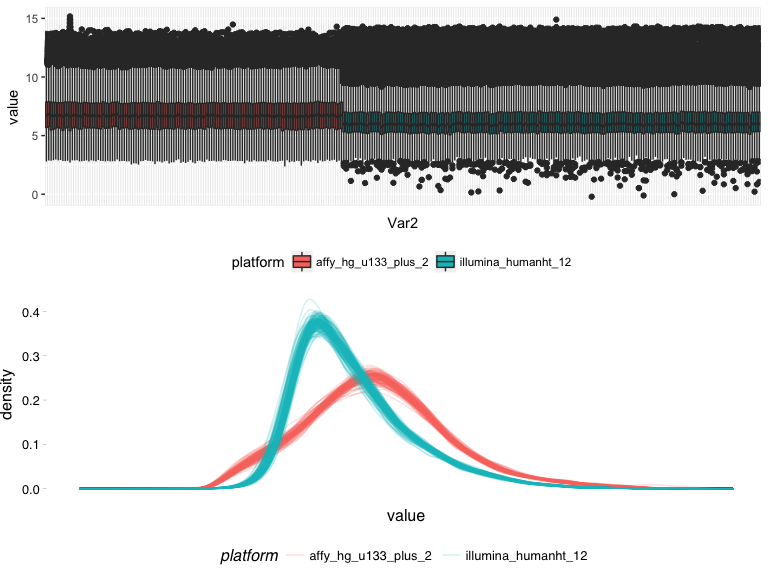
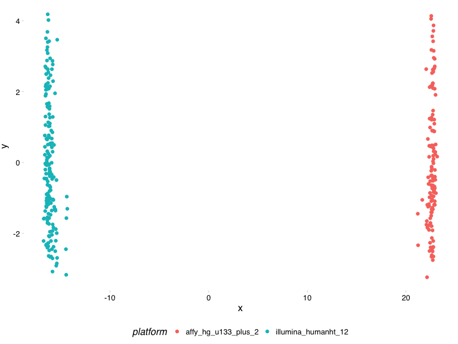
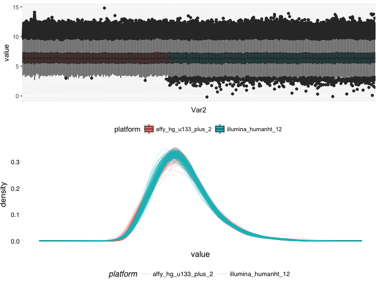
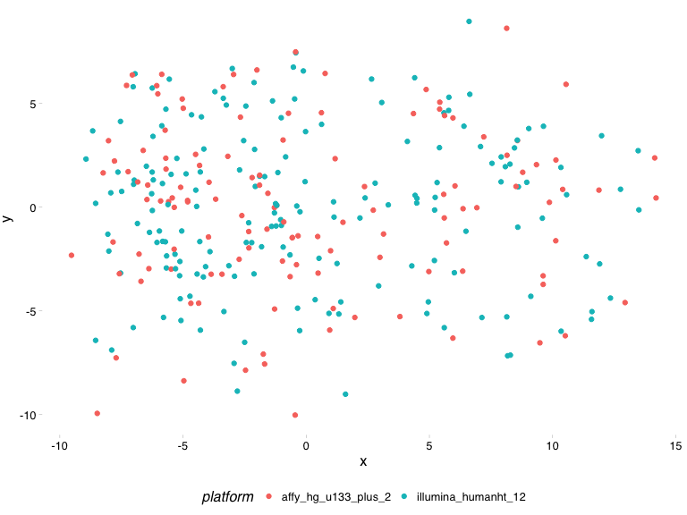
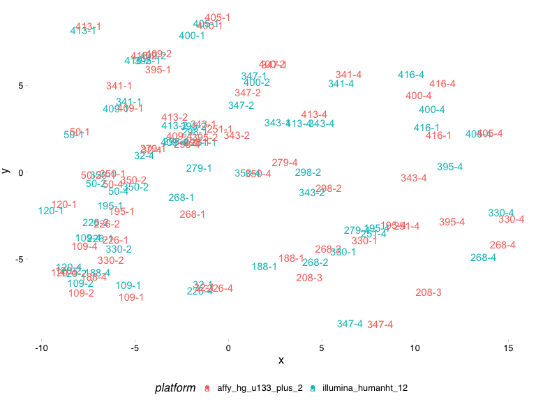
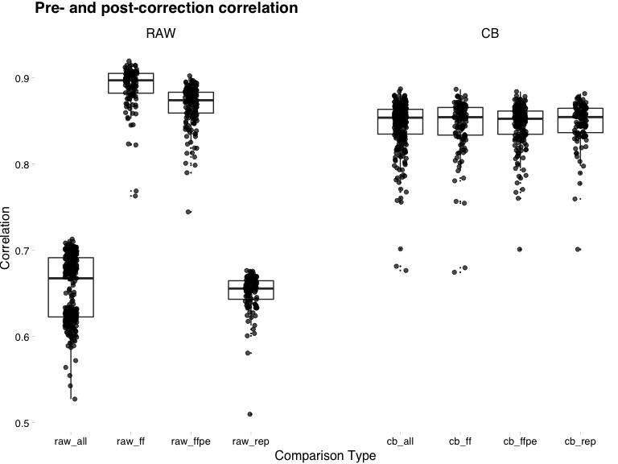

Dataset correction
================
Dominic Pearce

#### //TODO : before I can select replicates to remove I need to know if they were FF of FFPE, which I don't have for the illumina data (I don't think)

#### //TODO : I've ignored recurrence data below but this needs to be integrated into the integration as well

#### //TODO : When using the updated edset data, there'll likely have to be a couple of bits and pieces to fix from Cigdem's output

#### //TODO use better idReplace version (probe deicison by highest summed total)

``` r
library(tidyverse)
library(Biobase)
library(sva)
library(testthat)
source("/Volumes/igmm/sims-lab/Dominic/functions/idReplace.R")
source("/Volumes/igmm/sims-lab/Dominic/functions/convert-id-to-gene-symbol-with-biomart.R")
```

#### Now we have the two dormancy datasets - Edinburgh & Georgetown - pre-processed and ready to analyse. In addition to their independent analysis, we'll also want to pool all samples into a single dataset for maximum power. **However**, having been pre-processed months apart, in different countries and by different people, before combining we first need to make sure their clinical data is analogous.

#### Ideally we want to keep as much information as possible but ultimately there will be fields in one eset that aren't found in the other.

``` r
ggset <- read_rds("../output/final-georgeset-sep-frma-fselect-loess-clin-cb.Rds")
edset <- read_rds("../../edinburgh/output/dorm-v4.rds")
edset$platform <- "illumina_humanht_12"
edset$xpr_id <- colnames(edset)

ggsub <- pData(ggset)[, c("sample_id", "patient_id", "is_dormant", "timepoint", "days_treated", "biopsy", "Age", "T", "N", "M", "ER", "Overall.HER2", "platform", "xpr_id")]
edsub <- pData(edset)[, c("ID_D120days_3cat", "patient.no", "dorm.group_v4", "time.point_3cat", "days_newinfo", "biopsy.no", "age", "T", "N", "M", "ER", "HER_myfinaldecision", "platform", "xpr_id")]
new_cols <- c("sample_id", "patient_id", "is_dormant", "timepoint", "days_treated", "biopsy_no", "age", "T", "N", "M", "ER_allred", "is_her2", "platform", "xpr_id")
colnames(ggsub) <- new_cols
colnames(edsub) <- new_cols

edsub$is_dormant <- edsub$is_dormant == "D"
edsub$timepoint <- ifelse(edsub$timepoint == "1", "diagnosis", 
                          ifelse(edsub$timepoint == "2", "on-treatment", "long-term"))
edsub$is_her2 <- ifelse(edsub$is_her2 == "1", TRUE, 
                        ifelse(edsub$is_her2 == "0", FALSE, NA))


ggsub$is_her2 <- ifelse(ggsub$is_her2 == "pos", TRUE, 
                        ifelse(ggsub$is_her2 == "neg", FALSE, NA))
```

``` r
##Convert georgtown xpr to official gene symbols
##The idReplace function was hanging indefinately so I've coded the conversion explicitly here
#x <- id2GeneSymbolBM(row.names(exprs(ggset)), "affy_hg_u133_plus_2", "hgnc_symbol")
#y <- merge(x, exprs(ggset), by.x = "affy_hg_u133_plus_2", by.y = 0)
#y[y == ""] <- NA
#y <- na.omit(y)
#z <- aggregate(y, list(y$hgnc_symbol), FUN = mean)
#row.names(z) <- z$Group.1
#z[,c("Group.1", "affy_hg_u133_plus_2", "hgnc_symbol")] <- NULL
#gghgnc <- z

#gghgnc <- idReplace(exprs(ggset), "affy_hg_u133_plus_2", "hgnc_symbol")
```

#### Now with our datasets made comparable we combine phenotypic and assay data as a single expression set `dormset`

``` r
#Combine expression
dorm_xpr <- merge(exprs(edset), gghgnc, by = 0)
row.names(dorm_xpr) <- dorm_xpr$Row.names
dorm_xpr$Row.names <- NULL

#Combine clinical and determine shared samples
dorm_pheno <- rbind(edsub, ggsub)
shared_samples <- names(which(table(dorm_pheno$sample_id) != 1))
dorm_pheno$is_dataset_replicate <- dorm_pheno$sample_id %in% shared_samples

test_that("dimnames are correct between xpr and pheno", {
              expect_identical(row.names(dorm_pheno), colnames(dorm_xpr))
                        })

#Build expressionSet
buildeSet <- function(xpr, pheno){
    test_that("dimnames are correct between xpr and pheno", {
                  expect_identical(row.names(pheno), colnames(xpr))
                        })
    metadata <- data.frame(labelDescription = colnames(pheno), row.names = colnames(pheno))
    phenoData <- new("AnnotatedDataFrame", data = pheno, varMetadata = metadata)
    ExpressionSet(
                  assayData = as.matrix(xpr),
                  phenoData = phenoData
                  )
}
dormset <- buildeSet(dorm_xpr, dorm_pheno)
```

#### Now we check for batch differences, correct using ComBat and validate our approach using the samples which are replicated between the two datasets.

#### *PRE-ComBat*

``` r
source("../lib/plot-batch-effects.R")
```

    ## [1] "functions are batchEffectDists() & batchEffectMDS()"

``` r
batchEffectDists(dormset, "platform")
```



``` r
batchEffectMDS(dormset, "platform")
```



#### *POST-ComBat*

``` r
dorm_cb <- ComBat(exprs(dormset), batch = dormset$platform)
```

    ## Standardizing Data across genes

``` r
dormset_cb <- buildeSet(dorm_cb, pData(dormset))

batchEffectDists(dormset_cb, "platform")
```



``` r
batchEffectMDS(dormset_cb, "platform")
```



#### Replicates & replicate correlations

``` r
batchEffectMDS(dormset_cb[, dormset_cb$is_dataset_replicate], "platform") + 
    geom_point(colour = "WHITE") + 
    geom_text(aes(label = sample_id))
```



``` r
getSampleCors <- function(mtx){
    cor_mtx <- cor(mtx)
    diag(cor_mtx) <- NA
    colMeans(cor_mtx, na.rm = TRUE)
}

input_lst <- list(raw_all = exprs(dormset), 
                  raw_ff = exprs(dormset)[, dormset$platform == "affy_hg_u133_plus_2"],
                  raw_ffpe = exprs(dormset)[, dormset$platform == "illumina_humanht_12"],
                  raw_rep = exprs(dormset)[, dormset$is_dataset_replicate],
                  cb_all = exprs(dormset_cb), 
                  cb_ff = exprs(dormset_cb)[, dormset_cb$platform == "affy_hg_u133_plus_2"],
                  cb_ffpe = exprs(dormset_cb)[, dormset_cb$platform == "illumina_humanht_12"],
                  cb_rep = exprs(dormset_cb)[, dormset_cb$is_dataset_replicate]
                  )

cor_dfr <- lapply(names(input_lst), function(x){
                      data.frame(cor = getSampleCors(input_lst[[x]]), 
                                 comparison = x, 
                                 xpr_id = colnames(input_lst[[x]]))
                  }) %>% do.call(rbind, .)
cor_dfr$correction <- factor(ifelse(grepl("raw", cor_dfr$comparison), "RAW", "CB"), 
                             levels = c("RAW", "CB"))

ggplot(cor_dfr, aes(x = comparison, cor)) + 
    geom_boxplot(outlier.size = 0) + 
    geom_jitter(width = 0.1, alpha = 0.7) +
    facet_wrap(~correction, nrow = 1, scales = 'free_x') + 
    labs(x = "Comparison Type", 
         y = "Correlation", 
         title = "Pre- and post-correction correlation") +
    theme_pander() +
    theme(panel.spacing = unit(5, "lines"))
```



``` r
#ff_cor_dfr <- cor_dfr[grep("ff$", cor_dfr$comparison), ]
#wilcox.test(cor ~ comparison, data = ff_cor_dfr)
```

``` r
lapply(names(input_lst), function(x){
           data.frame(Correlation = mean(cor_dfr[cor_dfr$comparison == x,]$cor), 
                      Comparison = x) 
         }) %>% 
    do.call(rbind, .) %>%
    t() %>% 
    knitr::kable()
```

|             |           |           |           |           |           |           |           |           |
|:------------|:----------|:----------|:----------|:----------|:----------|:----------|:----------|:----------|
| Correlation | 0.6549376 | 0.8898521 | 0.8679891 | 0.6509701 | 0.8454978 | 0.8448692 | 0.8450715 | 0.8475899 |
| Comparison  | raw\_all  | raw\_ff   | raw\_ffpe | raw\_rep  | cb\_all   | cb\_ff    | cb\_ffpe  | cb\_rep   |

#### ComBat appears to great, cross-dataset replicate correlations have increased dramtically, whilst the intra-batch correlations have not decreased to the same extent, though there is a significant difference in raw FF and CB FF correlations. It should also be noted however that this is the second decrease in correlations due to batch correction, following the original FF vs. FFPE corrections.

We'll again (*see: batch-correction.md*) select replicates to keep by removing the replicate with the lowest pre-correction intra-batch correlation.
----------------------------------------------------------------------------------------------------------------------------------------------------

#### Order the data in a sensible way and then write
