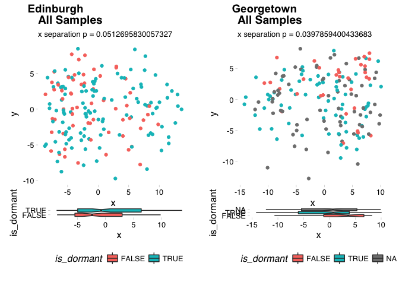
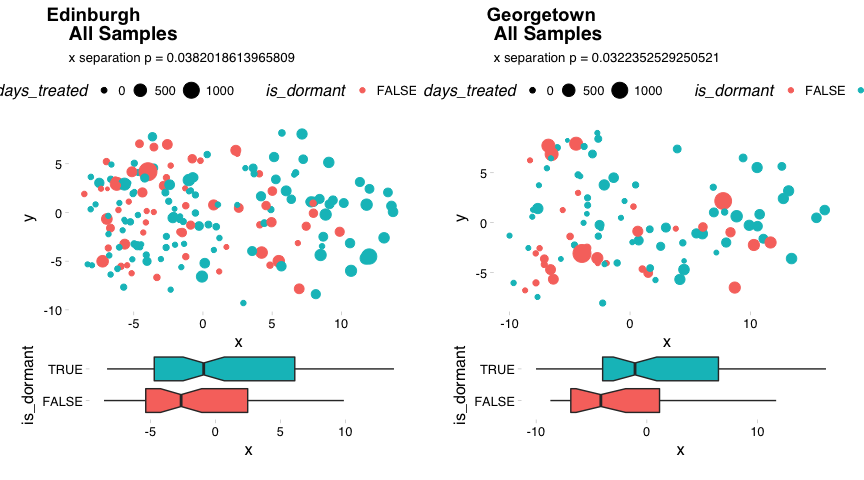
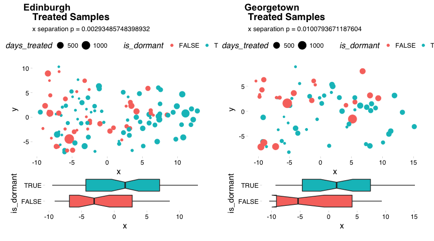
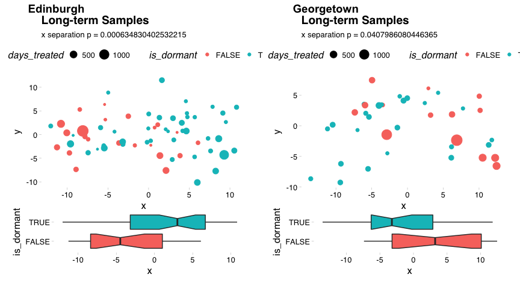

Dominic Pearce

``` r
library(tidyverse)
library(Biobase)
library(ggthemes)
library(cowplot); theme_set(theme_grey())
source("/Volumes/igmm/sims-lab/Dominic/functions/idReplace.R")
source("/Volumes/igmm/sims-lab/Dominic/functions/mostVar.R")
source("/Volumes/igmm/sims-lab/Dominic/functions/library/mdsArrange.R")
```

#### Here we'll compare the unsupervised approach used with the Edinburgh data with the new Georgetown data. To begin for each set we'll calculate the most variable 500 genes between on-treatment and long-term samples (thereby avoiding the larest likely source of variation - treatment) and test how well they stratify dormany and non-dormant patients.

#### Simlarly as in *subtyping* I'll need to alter ed- or georgeset to match - eventually this will be done properly and comprehensively.

``` r
edset <- read_rds("../../edinburgh/output/dorm-v4.rds")
edset$xpr_id <- edset$ID_D120days_3cat
edset$patient_id <- edset$patient.no
edset$is_dormant <- edset$dorm.group_v4 == "D"
edset$timepoint <- ifelse(edset$time.point_3cat == 1, "diagnosis", 
                          ifelse(edset$time.point_3cat == 2, "on-treatment", "long-term"))

georgeset_affy <- read_rds("../output/final-georgeset-sep-frma-fselect-loess-clin-cb.Rds")
xpr_hgnc <- idReplace(exprs(georgeset_affy), 
                        id.in = "affy_hg_u133_plus_2", 
                        id.out = "hgnc_symbol")
phenoData <- new("AnnotatedDataFrame", 
                 data = pData(georgeset_affy),  
                 varMetadata = varMetadata(georgeset_affy))
georgeset <- new("ExpressionSet", 
                   exprs = as.matrix(xpr_hgnc), 
                   phenoData = phenoData)

eset_lst <- list(edset, georgeset)
```

#### We can calculate the 500 most-variable genes independently for each dataset and compare their overlap

``` r
eset500_lst <- lapply(eset_lst, function(eset){
                          eset_sub <- eset[, which(eset$timepoint != 'diagnosis')]
                          mv500 <- mostVar(exprs(eset_sub), 500) %>% row.names()
                          eset[mv500,]
})

do.call(intersect, lapply(eset500_lst, row.names))
```

    ##   [1] "MUCL1"       "S100P"       "PIP"         "SCGB2A1"     "FOSB"       
    ##   [6] "SCGB2A2"     "GRIA2"       "CLEC3A"      "HMGCS2"      "NPY1R"      
    ##  [11] "FOS"         "CEACAM6"     "S100A7"      "TFF1"        "BMPR1B"     
    ##  [16] "CD24"        "PROM1"       "CLCA2"       "UGT2B28"     "VTCN1"      
    ##  [21] "HBB"         "FABP4"       "IGKV1D-17"   "LINC00993"   "SPP1"       
    ##  [26] "SERPINA3"    "PIGR"        "SLITRK6"     "HBA1"        "HBA2"       
    ##  [31] "THRSP"       "COL11A1"     "APOD"        "ACKR1"       "POTEB"      
    ##  [36] "POTEB2"      "POTEB3"      "COMP"        "JCHAIN"      "MAOA"       
    ##  [41] "KIF5C"       "CNTNAP2"     "S100A8"      "PPP1R1A"     "PTX3"       
    ##  [46] "AGR2"        "CD24P4"      "MFAP4"       "CRYAB"       "CYP4Z1"     
    ##  [51] "BAMBI"       "EGR3"        "CBLN2"       "UGT2B11"     "LRP2"       
    ##  [56] "SLC39A6"     "UBD"         "CCL14"       "CCL15-CCL14" "COL10A1"    
    ##  [61] "CA2"         "DUSP1"       "OLR1"        "GPAM"        "PLEKHS1"    
    ##  [66] "ENPP5"       "EGR1"        "PLIN1"       "CXCL9"       "PDK4"       
    ##  [71] "MAOB"        "PEG10"       "COL14A1"     "FHL1"        "ASPN"       
    ##  [76] "PKIB"        "CDH1"        "CILP"        "TOP2A"       "CYR61"      
    ##  [81] "IL33"        "KRT5"        "C8orf4"      "MATN3"       "C7"         
    ##  [86] "SHISA2"      "ZFP36"       "NR2F1"       "HOXC9"       "MUC1"       
    ##  [91] "TFAP2B"      "SYT13"       "SCNN1A"      "G0S2"        "SCUBE2"     
    ##  [96] "CCDC80"      "TF"          "TACSTD2"     "MRPS30"      "CD36"       
    ## [101] "LYPD6B"      "TBC1D9"      "NDNF"        "GLDN"        "PTN"        
    ## [106] "GHR"         "COL5A2"      "DHRS2"       "NTNG1"       "CHI3L1"     
    ## [111] "MB"          "UNC5A"       "SLC26A3"     "BEX2"        "SFRP1"      
    ## [116] "AGR3"        "GABRP"       "CAVIN2"      "LPL"         "NTN4"       
    ## [121] "SYCP2"       "IRX2"        "MKX"         "GATA3"       "MAL2"       
    ## [126] "GP2"         "TM4SF18"     "PRLR"        "CLSTN2"      "GRP"        
    ## [131] "AKR1C3"      "MGP"         "FNDC1"       "CEP55"       "CDR1"       
    ## [136] "MEOX1"       "EPCAM"       "CARTPT"      "CLDN8"       "STC2"       
    ## [141] "ANXA3"       "ADAMTS1"     "NAT1"        "TIMP4"       "SOCS2"      
    ## [146] "GREM1"       "MMP13"       "GAS1"        "RGS1"        "CCL2"       
    ## [151] "LIFR"        "HMCN1"       "MLPH"        "KCNJ3"       "C15orf48"   
    ## [156] "MIR147B"     "OGN"         "GJB2"        "POSTN"       "CD300LG"    
    ## [161] "IER3"        "AOX1"        "GZMK"        "CXCL10"      "AGTR1"      
    ## [166] "OPRPN"       "ALDH3B2"     "CEACAM5"     "AURKA"       "HOTAIR"     
    ## [171] "STC1"        "MMP3"        "ANXA1"       "GEM"         "CYP4F8"     
    ## [176] "FOXA1"       "SPARCL1"     "HLA-DQA2"    "RGS5"        "SYNM"       
    ## [181] "IFI44L"      "WISP2"       "SCUBE3"      "C1QB"        "CPA3"       
    ## [186] "SFRP2"       "NDP"         "HLA-DQA1"    "PCSK1"       "MFAP5"

#### as well as how well the are able to cluster patients based on dormancy status

``` r
plotMDS <- function(eset, time_point = "all", title = ""){
           if(time_point != "all"){
               eset_in = eset[, which(eset$timepoint == time_point)]
           } else {
               eset_in = eset 
           }
           arng_dfr <- mdsArrange(exprs(eset_in))
           mrg_dfr <- merge(arng_dfr, pData(eset_in), by.x = 'ids', by.y = 'xpr_id')
           p_mds <- ggplot(mrg_dfr, aes(x = x, y = y, colour = is_dormant)) + 
               geom_point() + 
               labs(title = title,
                    subtitle = paste0("x separation p = ", 
                                      wilcox.test(x~is_dormant, data = mrg_dfr)$p.value)) +
               theme_pander() +
               theme(legend.position = 'none')
           p_box <- ggplot(mrg_dfr, aes(x = is_dormant, y = x, fill = is_dormant)) + 
               geom_boxplot(notch = TRUE) + 
               coord_flip() + 
               theme_pander() + 
               theme(legend.position = 'bottom')
           plot_grid(p_mds, p_box, rel_heights = c(3, 1), ncol = 1)
}
```

### All samples

``` r
lapply(eset500_lst, function(x) plotMDS(x, 'all', 'All Samples')) %>% 
    plot_grid(plotlist = ., labels = c("Edinburgh", "Georgetown"), scale = 0.9)
```



### Long-term samples

``` r
lapply(eset500_lst, function(x) plotMDS(x, 'long-term', 'Long-term Samples')) %>% 
    plot_grid(plotlist = ., labels = c("Edinburgh", "Georgetown"), scale = 0.9)
```



### On-treatment samples

``` r
lapply(eset500_lst, function(x) plotMDS(x, 'on-treatment', 'On-treatment Samples')) %>% 
    plot_grid(plotlist = ., labels = c("Edinburgh", "Georgetown"), scale = 0.9)
```



### Diagnostic samples

``` r
lapply(eset500_lst, function(x) plotMDS(x, 'diagnosis', 'Diagnostic Samples')) %>% 
    plot_grid(plotlist = ., labels = c("Edinburgh", "Georgetown"), scale = 0.9)
```


