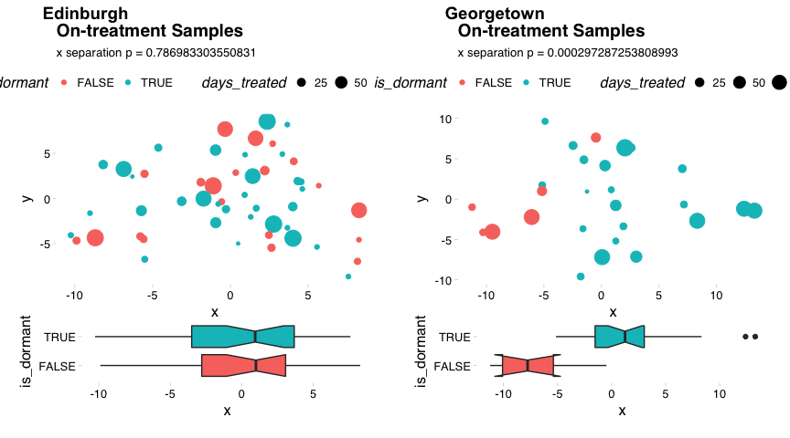
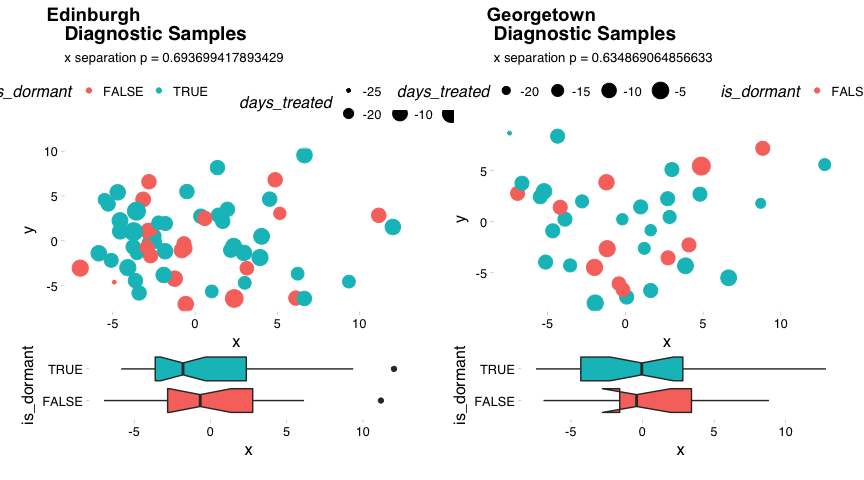

Unsupervised Analysis
================
Dominic Pearce

``` r
library(tidyverse)
library(Biobase)
library(ggthemes)
library(cowplot); theme_set(theme_grey())
source("/Volumes/igmm/sims-lab/Dominic/functions/idReplace.R")
source("/Volumes/igmm/sims-lab/Dominic/functions/mostVar.R")
source("/Volumes/igmm/sims-lab/Dominic/functions/library/mdsArrange.R")
```

#### Here we'll compare the unsupervised approach used with the Edinburgh data with the new Georgetown data. To begin for each set we'll calculate the most variable 500 genes between on-treatment and long-term samples (thereby avoiding the larest likely source of variation - treatment) and test how well they stratify dormany and non-dormant patients.

#### Simlarly as in *subtyping* I'll need to alter ed- or georgeset to match - eventually this will be done properly and comprehensively.

``` r
edset <- read_rds("../../edinburgh/output/dorm-v4.rds")
edset$xpr_id <- edset$ID_D120days_3cat
edset$patient_id <- edset$patient.no
edset$is_dormant <- edset$dorm.group_v4 == "D"
edset$timepoint <- ifelse(edset$time.point_3cat == 1, "diagnosis", 
                          ifelse(edset$time.point_3cat == 2, "on-treatment", "long-term"))
edset$days_treated <- edset$days_newinfo

georgeset_base <- read_rds("../output/final-georgeset-sep-frma-fselect-loess-clin-cb.Rds")
georgeset_affy <- georgeset_base[, !is.na(georgeset_base$is_dormant)]
xpr_hgnc <- idReplace(exprs(georgeset_affy), 
                        id.in = "affy_hg_u133_plus_2", 
                        id.out = "hgnc_symbol")
phenoData <- new("AnnotatedDataFrame", 
                 data = pData(georgeset_affy),  
                 varMetadata = varMetadata(georgeset_affy))
georgeset <- new("ExpressionSet", 
                   exprs = as.matrix(xpr_hgnc), 
                   phenoData = phenoData)

eset_lst <- list(edset, georgeset)
```

#### We can calculate the 500 most-variable genes independently for each dataset and compare their overlap

``` r
eset500_lst <- lapply(eset_lst, function(eset){
                          eset_sub <- eset[, which(eset$timepoint == 'long-term')]
                          mv500 <- mostVar(exprs(eset_sub), 500) %>% row.names()
                          eset[mv500,]
})

do.call(intersect, lapply(eset500_lst, row.names))
```

    ##   [1] "MUCL1"       "S100P"       "PIP"         "SCGB2A1"     "FOSB"       
    ##   [6] "CEACAM6"     "CLEC3A"      "TFF1"        "GRIA2"       "CD24"       
    ##  [11] "CLCA2"       "SERPINA3"    "KRT14"       "SCGB2A2"     "PROM1"      
    ##  [16] "BMPR1B"      "SPP1"        "IGKV1D-17"   "FOS"         "UGT2B28"    
    ##  [21] "FABP4"       "PTX3"        "LINC00993"   "PIGR"        "COL11A1"    
    ##  [26] "THRSP"       "NPY1R"       "HBB"         "SLITRK6"     "VTCN1"      
    ##  [31] "HBA1"        "HBA2"        "PPP1R1A"     "AGR2"        "COMP"       
    ##  [36] "ACKR1"       "POTEB"       "POTEB2"      "POTEB3"      "OLR1"       
    ##  [41] "MAOA"        "CFD"         "JCHAIN"      "CYP4Z1"      "CD177"      
    ##  [46] "KRT5"        "CD24P4"      "CRYAB"       "PLIN1"       "S100A8"     
    ##  [51] "LRP2"        "GPAM"        "COL10A1"     "ELN"         "CCL14"      
    ##  [56] "CCL15-CCL14" "PDK4"        "COL14A1"     "PLEKHS1"     "CXCL9"      
    ##  [61] "TOP2A"       "RERGL"       "NR2F1"       "PKIB"        "PCOLCE2"    
    ##  [66] "HOXC9"       "FHL1"        "MFAP4"       "SYT13"       "ENPP5"      
    ##  [71] "IL33"        "G0S2"        "UGT2B11"     "FAM3B"       "PEG10"      
    ##  [76] "CA2"         "CILP"        "GABRP"       "SERPINE1"    "C7"         
    ##  [81] "SAA1"        "MB"          "MUC1"        "SCNN1A"      "CD36"       
    ##  [86] "C8orf4"      "EGR3"        "TACSTD2"     "LPL"         "CARTPT"     
    ##  [91] "DUSP1"       "LRRN1"       "CXADR"       "ZFP36"       "GLDN"       
    ##  [96] "CEP55"       "SFRP1"       "FNDC1"       "CLDN8"       "TFAP2B"     
    ## [101] "CAVIN2"      "CCDC80"      "PTN"         "EPCAM"       "CYR61"      
    ## [106] "BEX2"        "ADAMTS1"     "SLC26A3"     "AURKA"       "MLPH"       
    ## [111] "TF"          "MAL2"        "SYCP2"       "GHR"         "TIMP4"      
    ## [116] "CXCL2"       "CBLN2"       "SYNM"        "CD300LG"     "AGR3"       
    ## [121] "OPRPN"       "MEOX1"       "GATA3"       "UNC5A"       "GP2"        
    ## [126] "AZGP1"       "KCNJ3"       "PRLR"        "LIFR"        "SCUBE2"     
    ## [131] "STC1"        "NDNF"        "HSPB8"       "FOXA1"       "GRP"        
    ## [136] "CHI3L1"      "PLA2G2A"     "MRPS30"      "DHRS2"       "AKR1C3"     
    ## [141] "CCL28"       "MMP13"       "HLA-DQA2"    "HMCN1"       "CYP4F8"     
    ## [146] "TBC1D9"      "PCSK1"       "SHISA2"      "LYPD6B"      "ANXA3"      
    ## [151] "NAT1"        "C15orf48"    "MIR147B"     "SEMA3G"      "CCL2"       
    ## [156] "MMP3"        "EGR1"        "PCK1"        "GEM"         "MGP"        
    ## [161] "MEST"        "AOX1"        "MKX"         "GJB2"        "CCL8"       
    ## [166] "HLA-DQA1"    "TM4SF18"     "RASEF"       "POU2AF1"     "OLFM4"      
    ## [171] "MFAP5"       "CYP2B7P"     "ALDH3B2"     "STC2"        "INHBA"      
    ## [176] "GAS1"        "TC2N"        "AGTR1"       "C1QB"        "ANXA1"      
    ## [181] "CIDEC"       "CEACAM5"     "NDP"

#### as well as how well the are able to cluster patients based on dormancy status

``` r
plotMDS <- function(eset, time_point = "all", title = ""){
    if(time_point[[1]] != "all"){
               eset_in = eset[, which(eset$timepoint %in% time_point)]
           } else {
               eset_in = eset 
           }
           arng_dfr <- mdsArrange(exprs(eset_in))
           mrg_dfr <- merge(arng_dfr, pData(eset_in), by.x = 'ids', by.y = 'xpr_id')

           p_mds <- ggplot(mrg_dfr, aes(x = x, y = y, colour = is_dormant, size = days_treated)) + 
               geom_point() + 
               labs(title = title,
                    subtitle = paste0("x separation p = ", 
                                      wilcox.test(x~is_dormant, data = mrg_dfr)$p.value)) +
               theme_pander() +
               theme(legend.position = 'top')

           p_box <- ggplot(mrg_dfr, aes(x = is_dormant, y = x, fill = is_dormant)) + 
               geom_boxplot(notch = TRUE) + 
               coord_flip() + 
               theme_pander() + 
               theme(legend.position = 'none')
           plot_grid(p_mds, p_box, rel_heights = c(3, 1), ncol = 1)
}
```

### All samples

``` r
lapply(eset500_lst, function(x) plotMDS(x, 'all', 'All Samples')) %>% 
    plot_grid(plotlist = ., labels = c("Edinburgh", "Georgetown"), scale = 0.9)
```


### Treated samples

``` r
lapply(eset500_lst, function(x) plotMDS(x, c('on-treatment', 'long-term'), 'Treated Samples')) %>% 
    plot_grid(plotlist = ., labels = c("Edinburgh", "Georgetown"), scale = 0.9)
```


### Long-term samples

``` r
lapply(eset500_lst, function(x) plotMDS(x, 'long-term', 'Long-term Samples')) %>% 
    plot_grid(plotlist = ., labels = c("Edinburgh", "Georgetown"), scale = 0.9)
```


### On-treatment samples

``` r
lapply(eset500_lst, function(x) plotMDS(x, 'on-treatment', 'On-treatment Samples')) %>% 
    plot_grid(plotlist = ., labels = c("Edinburgh", "Georgetown"), scale = 0.9)
```



### Diagnostic samples

``` r
lapply(eset500_lst, function(x) plotMDS(x, 'diagnosis', 'Diagnostic Samples')) %>% 
    plot_grid(plotlist = ., labels = c("Edinburgh", "Georgetown"), scale = 0.9)
```


