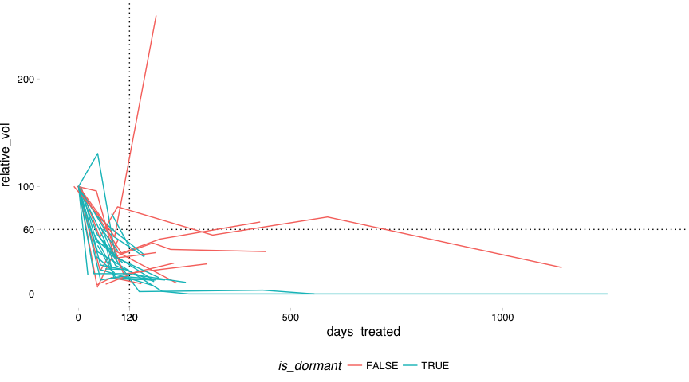
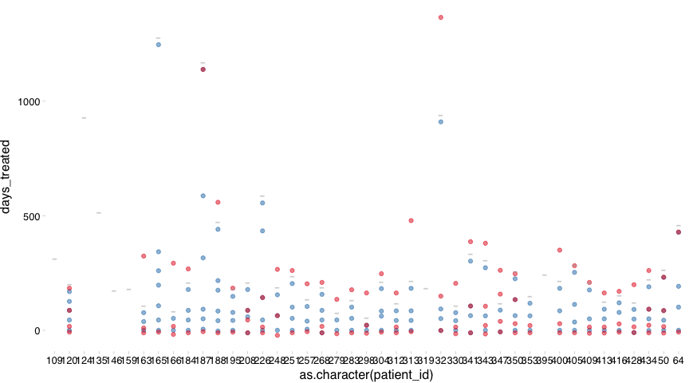
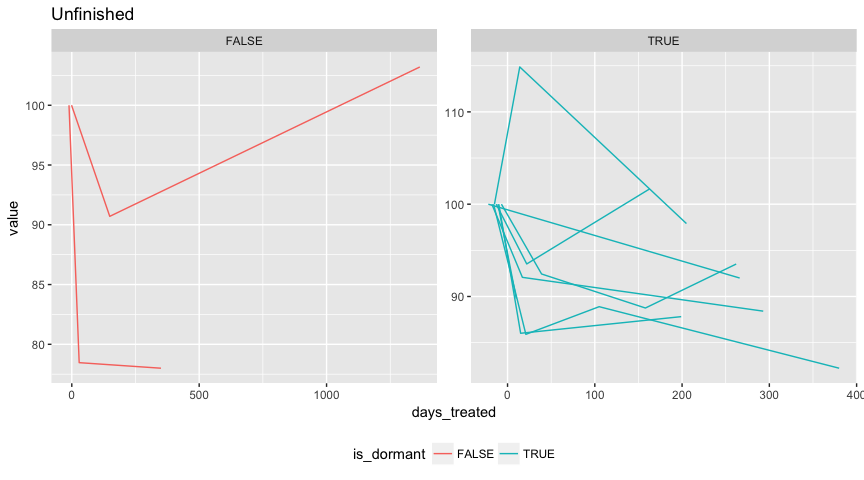

USS classification
================
Dominic Pearce

``` r
library(tidyverse)
library(Biobase)
library(reshape2)
library(ggthemes)
source("../../../../functions/convert-id-to-gene-symbol-with-biomart.R")
```

``` r
dormant_dfr <- read.csv("../output/uss-clin.csv")
georgeset <- read_rds("../output/final-georgeset-sep-frma-fselect-loess-clin-cb.Rds")
```

#### Here we'll visualise the ultrasound measurements over time treated, differentiating between dormant and desensitiesd patients (as defined in **clinical-curation**).

#### We can immediately see that a number of patients (grey) do not meet the required characteristics to be included in the dormancy study proper (i.e. there is not a pre-90 drop in tumour volume of at least 40%).

``` r
ggplot(dormant_dfr, aes(x = days_treated, 
                        y = relative_vol, 
                        group = patient_id, 
                        colour = is_dormant)) + 
    geom_vline(xintercept = c(90), linetype = 3) + 
    geom_hline(yintercept = 60, linetype = 3) + 
    geom_line() + 
    scale_y_continuous(breaks = c(0, 60, 100, 200)) +
    scale_x_continuous(breaks = c(0, 90, 500, 1000)) +
    theme_pander() +
    theme(legend.position = 'bottom')
```


#### Therefore we'll remove these patients and replot, in addition to limiting out x-axis to 250 days to better visualise the early volume changes (where most measurements are found).

``` r
dormonly_dfr <- dormant_dfr[!is.na(dormant_dfr$is_dormant),]

p_uss <- ggplot(dormonly_dfr, aes(x = days_treated, 
                        y = relative_vol, 
                        group = patient_id, 
                        colour = is_dormant)) + 
    geom_vline(xintercept = 90, linetype = 3) + 
    geom_hline(yintercept = 60, linetype = 3) + 
    geom_line() + 
    scale_y_continuous(breaks = c(0, 60, 100, 200)) +
    scale_x_continuous(breaks = c(0, 90, 120, 500, 1000)) +
    theme_pander() +
    theme(legend.position = 'bottom')

p_uss
```



``` r
p_uss + coord_cartesian(c(-12, 250))
```


#### If the final biopsy was taken over a month after the final USS measurement, we instead use a expression signature as a surrogate to determine dormancy. The signature is the summed expression of three proliferation markers : *PCNA*, *MKI67* & *MCM2*

#### In the below plot we can see that there are several instances where the final biopsy (***red***) does exceed the final USS measurement (***blue***) by more than a month, rendering our dormancy signature as dervied from the USS measurements as potentially unreliable.

``` r
ggplot(dormonly_dfr, aes(x = as.character(patient_id), y = days_treated)) +
    geom_point(colour = "#1f78b4", alpha = 0.5, data = dormonly_dfr[dormonly_dfr$is_uss,]) + #blue
    geom_point(colour = "#e31a1c", alpha = 0.5, data = dormonly_dfr[dormonly_dfr$is_biopsy,]) + #red
    #facet_grid(~is_dormant, scales = 'free_x', space = 'free') +
    theme_pander() + 
    theme(panel.spacing = unit(2, 'cm'))
```



#### Therefore we need to identify these patients and use their associated expression values to re-classify

#### ***UNFINISHED***

``` r
xprdorm_dfr <- lapply(unique(dormant_dfr$patient_id), function(patient){
        #subset by patient and order 
        int_dfr <- dormant_dfr[which(dormant_dfr$patient_id == patient),]
        ord_dfr <- int_dfr[order(int_dfr$days_treated, decreasing = TRUE),]
        #then grab the day for the final biopsy and uss measurements and calculate the difference
        final_biopsy <- ord_dfr[which(ord_dfr$is_biopsy)[1],]$days_treated
        final_uss <- ord_dfr[which(ord_dfr$is_uss)[1],]$days_treated
        data.frame(patient_id = patient, is_xprdorm = final_biopsy - final_uss >= 30)
}) %>% do.call(rbind, .)

xprdorm_ind <- which(georgeset$patient_id %in% 
                     na.omit(xprdorm_dfr[xprdorm_dfr$is_xprdorm, ]$patient_id))

#get affy probe ids for PCNA, MCM2 and MKI67
probeset_dfr <- id2GeneSymbolBM(ids = c("PCNA", "MCM2", "MKI67"), 
                filters = "hgnc_symbol",
                attributes = "affy_hg_u133a")
probeset_dfr$affy_hg_u133a[probeset_dfr$affy_hg_u133a == ""] <- NA
probeset_all <- as.character(na.omit(probeset_dfr$affy_hg_u133a))
probeset_available <- row.names(georgeset)[which(row.names(georgeset) %in% probeset_all)]

xpr <- exprs(georgeset[probeset_available, xprdorm_ind])

xpr_mlt <- melt(xpr)
xpr_mrg <- merge(xpr_mlt, pData(georgeset), by.x = 'Var2', by.y = 0)
xpr_mrg$timepoint <- factor(xpr_mrg$timepoint, levels = c("diagnosis", "on-treatment", "long-term"))

ggplot(xpr_mrg, aes(x = days_treated, y = value, colour = is_dormant, group = patient_id)) + 
    geom_line() +
    facet_wrap(is_dormant~Var1, scales = 'free', ncol = 5) + 
#    theme_pander() + 
    theme(legend.position = 'bottom') + 
    ggtitle("Unfinished")
```


