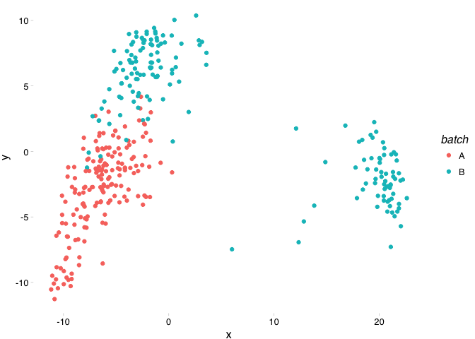
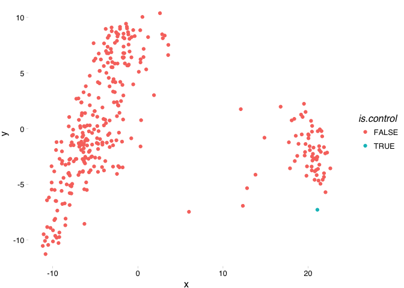
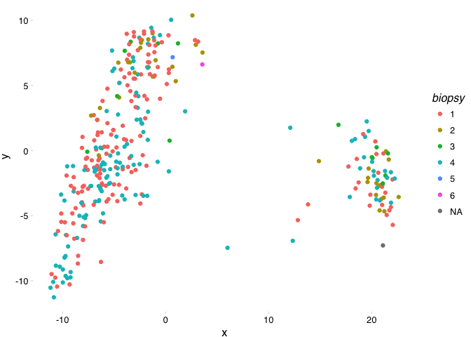
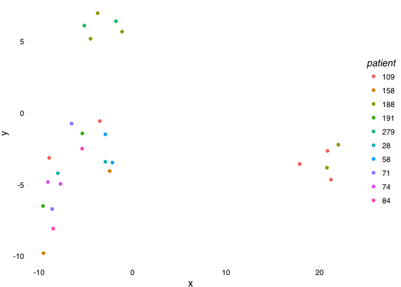
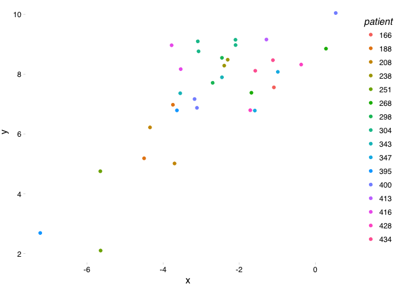
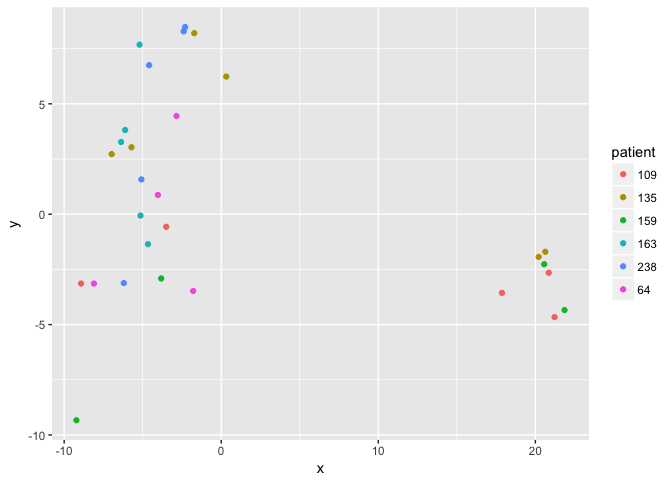

Georgetown Pre-processing
================
Dominic Pearce

``` r
library(affy)
library(tidyverse)
library(knitr)
library(ggthemes)
source("../../../../functions/mostVar.R")
source("../../../../functions/library/mdsArrange.R")
```

First we'll read in our .cel files in batch, normalise using RMA, add batch information, combine, edit the samples names to remove uneeded information and finally add fresh-frozen infromation.
------------------------------------------------------------------------------------------------------------------------------------------------------------------------------------------------

Actually one more thing, there appear to be technical replicates and control samples so we'll highlight this as well
--------------------------------------------------------------------------------------------------------------------

``` r
setwd("../data/Edinbrugh\ First\ Batch\ 170\ Samples")
batch_1 <- ReadAffy()
setwd("../Edinburgh\ Second\ Batch\ 170\ Samples/")
batch_2 <- ReadAffy()
setwd("../../src/")
batch_lst <- list(batch_1, batch_2)

eset_lst <- lapply(1:2, function(x){
    eset <- rma(batch_lst[[x]])
    eset$batch <- LETTERS[x]
    eset
})
georgeset <- do.call(combineTwoExpressionSet, eset_lst)

georgeset$is.freshfrozen <- ifelse(grepl("FF", colnames(georgeset), ignore.case = TRUE),
                                   TRUE, 
                                   ifelse(georgeset$batch == "B", 
                                          FALSE, 
                                          NA))

georgeset$is.replicate <- ifelse(grepl("-([0-9])-([0-9])([a-z])_", colnames(georgeset),
                                       ignore.case = TRUE), 
                                   "TRUE", 
                                   "FALSE")

georgeset$is.control <- ifelse(grepl("VHRR", colnames(georgeset), ignore.case = TRUE), 
                                   "TRUE", 
                                   "FALSE")

#the largest sample id is in the hundreds so chop to 3 characters and then remove anything that's 
#not a number
tmp_id1 <- substring(colnames(georgeset), 1, 3) 
georgeset$patient <- gsub("\\W", "", tmp_id1)

tmp1 <- gsub("[0-9]+-", "", colnames(georgeset))
tmp2 <- substring(tmp1[georgeset$batch == "B"], 1, 1)
tmp3 <- ifelse(grepl("PRE", colnames(georgeset)[georgeset$batch == "A"]), 1, 4)
georgeset$biopsy <- c(tmp3, tmp2)
georgeset$biopsy[georgeset$biopsy == "V"] <- NA

georgeset$sample <- 1:ncol(georgeset)

#write_rds(georgeset, "../output/georgeset.rds")
```

### So we've gone from this...

``` r
sapply(eset_lst, function(x) colnames(x)[1:5]) %>% data.frame() %>% kable()
```

| X1                               | X2                              |
|:---------------------------------|:--------------------------------|
| 100 POST\_(HG-U133\_Plus\_2).CEL | 109-1FF\_(HG-U133\_Plus\_2).CEL |
| 100 PRE\_(HG-U133\_Plus\_2).CEL  | 109-2FF\_(HG-U133\_Plus\_2).CEL |
| 102 POST\_(HG-U133\_Plus\_2).CEL | 109-4FF\_(HG-U133\_Plus\_2).CEL |
| 102 PRE\_(HG-U133\_Plus\_2).CEL  | 120-1FF\_(HG-U133\_Plus\_2).CEL |
| 103 POST\_(HG-U133\_Plus\_2).CEL | 120-2FF\_(HG-U133\_Plus\_2).CEL |

### To this...

``` r
pData(georgeset)[160:180,] %>% kable
```

|                                 |  sample| batch | is.freshfrozen | is.replicate | is.control | biopsy | patient |
|---------------------------------|-------:|:------|:---------------|:-------------|:-----------|:-------|:--------|
| 93 PRE\_(HG-U133\_Plus\_2).CEL  |     160| A     | NA             | FALSE        | FALSE      | 1      | 93      |
| 94 POST\_(HG-U133\_Plus\_2).CEL |     161| A     | NA             | FALSE        | FALSE      | 4      | 94      |
| 94 PRE\_(HG-U133\_Plus\_2).CEL  |     162| A     | NA             | FALSE        | FALSE      | 1      | 94      |
| 95 POST\_(HG-U133\_Plus\_2).CEL |     163| A     | NA             | FALSE        | FALSE      | 4      | 95      |
| 95 PRE\_(HG-U133\_Plus\_2).CEL  |     164| A     | NA             | FALSE        | FALSE      | 1      | 95      |
| 96 POST\_(HG-U133\_Plus\_2).CEL |     165| A     | NA             | FALSE        | FALSE      | 4      | 96      |
| 96 PRE\_(HG-U133\_Plus\_2).CEL  |     166| A     | NA             | FALSE        | FALSE      | 1      | 96      |
| 97 POST\_(HG-U133\_Plus\_2).CEL |     167| A     | NA             | FALSE        | FALSE      | 4      | 97      |
| 97 PRE\_(HG-U133\_Plus\_2).CEL  |     168| A     | NA             | FALSE        | FALSE      | 1      | 97      |
| 98 POST\_(HG-U133\_Plus\_2).CEL |     169| A     | NA             | FALSE        | FALSE      | 4      | 98      |
| 98 PRE\_(HG-U133\_Plus\_2).CEL  |     170| A     | NA             | FALSE        | FALSE      | 1      | 98      |
| 109-1FF\_(HG-U133\_Plus\_2).CEL |     171| B     | TRUE           | FALSE        | FALSE      | 1      | 109     |
| 109-2FF\_(HG-U133\_Plus\_2).CEL |     172| B     | TRUE           | FALSE        | FALSE      | 2      | 109     |
| 109-4FF\_(HG-U133\_Plus\_2).CEL |     173| B     | TRUE           | FALSE        | FALSE      | 4      | 109     |
| 120-1FF\_(HG-U133\_Plus\_2).CEL |     174| B     | TRUE           | FALSE        | FALSE      | 1      | 120     |
| 120-2FF\_(HG-U133\_Plus\_2).CEL |     175| B     | TRUE           | FALSE        | FALSE      | 2      | 120     |
| 120-3FF\_(HG-U133\_Plus\_2).CEL |     176| B     | TRUE           | FALSE        | FALSE      | 3      | 120     |
| 120-4FF\_(HG-U133\_Plus\_2).CEL |     177| B     | TRUE           | FALSE        | FALSE      | 4      | 120     |
| 124-1FF\_(HG-U133\_Plus\_2).CEL |     178| B     | TRUE           | FALSE        | FALSE      | 1      | 124     |
| 124-2FF\_(HG-U133\_Plus\_2).CEL |     179| B     | TRUE           | FALSE        | FALSE      | 2      | 124     |
| 124-3FF\_(HG-U133\_Plus\_2).CEL |     180| B     | TRUE           | FALSE        | FALSE      | 3      | 124     |

Calculate most variable 500 probes and plot as MDS
--------------------------------------------------

``` r
mv500 <- mostVar(exprs(georgeset), 500) %>% row.names()
gset_arg <- mdsArrange(exprs(georgeset[mv500, ]))
mds_input <- merge(gset_arg, pData(georgeset), by.x = 'ids', by.y = 0)
```

### FF vs. FFPE?

``` r
ggplot(mds_input, aes(x = x, y = y, colour = is.freshfrozen)) + geom_point() + theme_pander()
```


### Batch

``` r
ggplot(mds_input, aes(x = x, y = y, colour = batch)) + geom_point() + theme_pander()
```



### Controls

``` r
ggplot(mds_input, aes(x = x, y = y, colour = is.control)) + geom_point() + theme_pander()
```



### Biopsy No.

``` r
ggplot(mds_input, aes(x = x, y = y, colour = biopsy)) + geom_point() + theme_pander()
```



### Patient Pairs

``` r
set.seed(123)
ggplot(mds_input[which(mds_input$patient %in% sample(unique(mds_input$patient), 10)), ], 
       aes(x = x, y = y, colour = patient)) + geom_point() + theme_pander()
```



### Technical Replicates

``` r
ggplot(mds_input[mds_input$is.replicate == TRUE,], 
       aes(x = x, y = y, colour = patient)) + geom_point() + theme_pander()
```



Are there technical replicates across FF and FFPE samples?
----------------------------------------------------------

``` r
xbatch_ids <- georgeset[, georgeset$batch == "A"]$patient[which(georgeset[, georgeset$batch == "A"]$patient %in% georgeset[, georgeset$batch == "B"]$patient)]

ggplot(mds_input[mds_input$patient %in% xbatch_ids, ], aes(x = x, y = y, colour = patient)) + geom_point()
```


