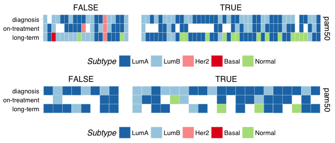

Dormancy Subtyping
================
Dominic Pearce

``` r
library(tidyverse)
library(genefu)
library(AIMS)
library(pamr)
library(Biobase)
library(ggthemes)
library(cowplot); theme_set(theme_grey())
source("/Volumes/igmm/sims-lab/Dominic/functions/idReplace.R")
```

``` r
edset <- read_rds("../../edinburgh/output/dorm-v4.rds")
edset$timepoint <- ifelse(edset$time.point_3cat == 1, "diagnosis", 
                           ifelse(edset$time.point_3cat == 2, "on-treatment", "long-term"))
edset$xpr_id <- edset$ID_D120days_3cat
edset$patient_id <- edset$patient.no
edset$is_dormant <- edset$dorm.group_v4 == "D"
georgeset_base <- read_rds("../output/final-georgeset-sep-frma-fselect-loess-clin-cb.Rds")
georgeset <- georgeset_base[, !is.na(georgeset_base$timepoint) & !is.na(georgeset_base$is_dormant)]

eset_lst <- list(edset, georgeset)
```

Convert to entrezgene ids (genefu requires this) and package as a new eset
--------------------------------------------------------------------------

``` r
id_vec <- c("hgnc_symbol", "affy_hg_u133_plus_2")
entrez_lst <- lapply(1:2, function(x){
                         xpr_entrez <- idReplace(exprs(eset_lst[[x]]), 
                                                 id.in = id_vec[x], 
                                                 id.out = "entrezgene")
                         phenoData <- new("AnnotatedDataFrame", 
                                          data = pData(eset_lst[[x]]),  
                                          varMetadata = varMetadata(eset_lst[[x]]))
                         eset_entrez <- new("ExpressionSet", 
                                            exprs = as.matrix(xpr_entrez), 
                                            phenoData = phenoData)
})
```

Calculate subtypes
------------------

``` r
preds_lst <- lapply(entrez_lst, function(eset_entrez){
    ano_dfr <- data.frame(probe = row.names(eset_entrez), 
                          EntrezGene.ID = row.names(eset_entrez), 
                          rownames = row.names(eset_entrez))
    ssp_lst <- list(ssp2003, ssp2006, pam50)
    names(ssp_lst) <- c("sorlie2003", "hu2006", "pam50")
    preds_base <- lapply(c("sorlie2003", "hu2006", "pam50"), function(ssp){
                            pred = intrinsic.cluster.predict(ssp_lst[[ssp]],
                                                             t(exprs(eset_entrez)), 
                                                             ano_dfr, 
                                                             do.mapping = TRUE)$subtype
                             dfr <- data.frame(pred = pred,
                                               method = ssp)
                             dfr$sample <- row.names(dfr)
                             dfr
                          }) %>% do.call(rbind, .)
    row.names(preds_base) <- NULL
    preds <-  preds_base[which(!grepl("e", preds_base$sample)),]
    
    preds_mrg <- merge(preds, pData(eset_entrez), by.x = "sample", by.y = "xpr_id")
    preds_mrg$time_tile <- factor(preds_mrg$timepoint, levels = c("long-term", "on-treatment", "diagnosis"))
    preds_mrg$time_hist <- factor(preds_mrg$timepoint, levels = c("diagnosis", "on-treatment", "long-term"))
    #order by time to final biopsy
#    tmp <- preds_mrg[which(preds_mrg$timepoint == "long-term" & preds_mrg$method == "pam50"),]
#    preds_mrg$patient_ord <- factor(preds_mrg$patient_id,
#                                    levels = tmp$patient_id[order(tmp$days_newinfo)])

    ggplot(preds_mrg[preds_mrg$method == "pam50",], aes(patient_id, y = time_tile, fill = pred)) + 
        geom_tile(width = 1, colour = "WHITE") + 
        scale_fill_manual(values=c("#1f78b4", "#a6cee3", "#fb9a99", "#e31a1c", "#b2df8a"), 
                        limits=c("LumA", "LumB", "Her2", "Basal", "Normal")) +
        facet_grid(method~is_dormant, scales = 'free', space = 'free') +
        labs(fill = "Subtype") + 
        ggthemes::theme_pander() + 
        theme(axis.title.y = element_blank(),
              axis.title.x = element_blank(),
              axis.text.x = element_blank(),
              axis.ticks.x = element_blank(),
              panel.spacing.x = unit(1.25, "lines"),
              legend.position = "bottom")
})


plot_grid(plotlist = preds_lst, ncol = 1)
```


