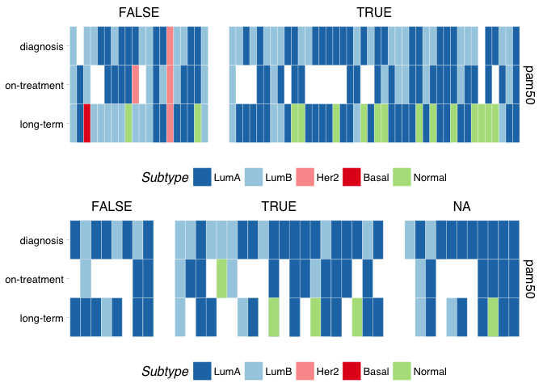

Dormancy Subtyping
================
Dominic Pearce

Convert to entrezgene ids (genefu requires this) and package as a new eset
--------------------------------------------------------------------------

Calculate subtypes
------------------

